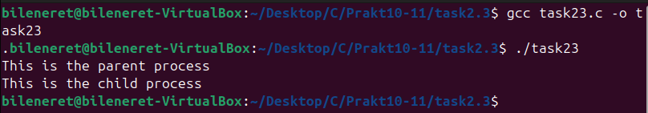
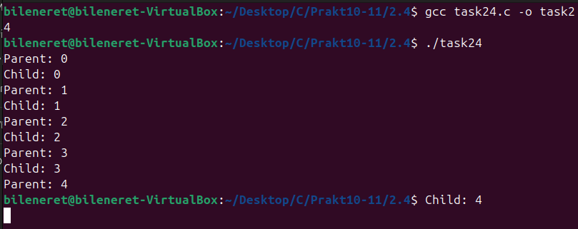
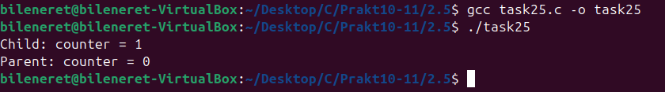
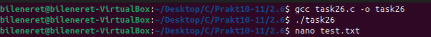
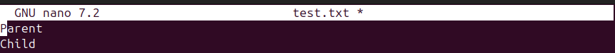
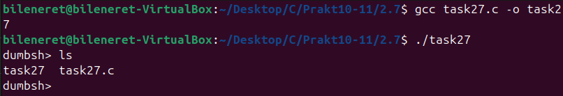
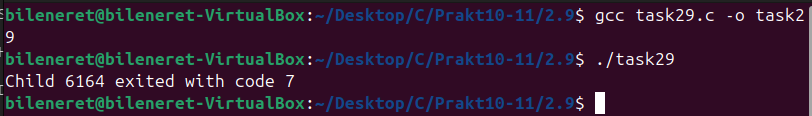
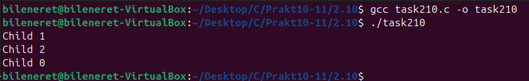
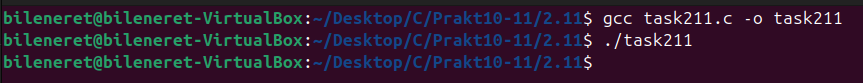
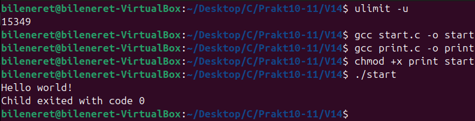

# ЗАВДАННЯ З ЛЕКЦІЇ №2.3:

## Пояснення та опис програми:
Програма використовує `fork()` для створення дочірнього процесу від батьківського. Якщо `fork()` повертає від’ємне значення, виводиться помилка `fork failed`. У разі успішного створення дочірнього процесу (повертається 0), виводиться "This is the child process". Для батьківського процесу (повертається PID дочірнього), виводиться "This is the parent process". Оскільки обидва процеси виконуються паралельно, повідомлення з’являються незалежно, демонструючи базовий механізм розгалуження в Unix.

### Результати:

### [Код завдання](2.3/task23.c)

---

# ЗАВДАННЯ З ЛЕКЦІЇ №2.4:

### Пояснення та опис програми:
Програма виконує `fork()`, генеруючи батьківський і дочірній процеси. Кожен із них проходить цикл від 0 до 4, де батьківський виводить "Parent: i", а дочірній — "Child: i" із затримкою `sleep(1)` на кожній ітерації. Завдяки паралельному виконанню та плануванню ОС, рядки з’являються в хаотичному порядку, відображаючи незалежність процесів. Це ілюструє, як `fork()` дозволяє одночасно виконувати логіку в кількох потоках.

### Результати:

### [Код завдання](2.4/task24.c)

---

# ЗАВДАННЯ З ЛЕКЦІЇ №2.5:

### Пояснення та опис програми:
Програма створює два процеси за допомогою `fork()`: батьківський і дочірній. Початкове значення `counter` дорівнює 0. Дочірній процес збільшує його до 1 і виводить "Child: counter = 1". Батьківський процес, після затримки `sleep(1)`, виводить "Parent: counter = 0", оскільки кожний процес має свою копію змінної. Це підкреслює, що пам’ять розгалужується при `fork()`, і зміни в одному процесі не впливають на інший.

### Результати:

### [Код завдання](2.5/task25.c)

---

# ЗАВДАННЯ З ЛЕКЦІЇ №2.6:

### Пояснення та опис програми:
Програма відкриває файл `test.txt` із правами створення та запису (`O_CREAT | O_WRONLY | O_TRUNC`, 0644), а потім викликає `fork()`. Дочірній процес записує "Child\n" у файл, а батьківський — "Parent\n", використовуючи спільний файловый дескриптор. Оскільки зміщувач файлу спільний, порядок записів залежить від планування ОС, і в результаті в `test.txt` з’являються обидва рядки поспіль, як видно на скриншотах.

### Результати:

### [Код завдання](2.6/task26.c)

---

# ЗАВДАННЯ З ЛЕКЦІЇ №2.7:

### Пояснення та опис програми:
Програма реалізує базовий командний інтерпретатор (shell) з циклом, який виводить підказку "dumbsh>". Вона зчитує рядок із `fgets`, видаляє символ нового рядка і перевіряє, чи введено "exit" для завершення. Інакше `fork()` створює дочірній процес, який виконує введену команду через `execlp()`, виводячи "exec failed" із кодом 1 при помилці. Батьківський процес чекає завершення дочірнього через `wait()`. Це дозволяє повторювати введення команд, як показано на скриншоті з послідовним виконанням.

### Результати:

### [Код завдання](2.7/task27.c)

---

# ЗАВДАННЯ З ЛЕКЦІЇ №2.9:

### Пояснення та опис програми:
Програма використовує `fork()` для створення дочірнього процесу, який одразу завершується з кодом `exit(7)`. Батьківський процес викликає `wait(&status)` для очікування завершення дочірнього, перевіряє статус через `WIFEXITED` і виводить "Child <PID> exited with code 7", де <PID> — ідентифікатор дочірнього процесу. Скриншот підтверджує вивід із коректним PID і кодом 7, ілюструючи механізм передачі статусу завершення.

### Результати:

### [Код завдання](2.9/task29.c)

---

# ЗАВДАННЯ З ЛЕКЦІЇ №2.10:

### Пояснення та опис програми:
Програма запускає цикл із трьох ітерацій, де на кожній `fork()` створює дочірній процес. Кожен дочірній виводить "Child i" (де i — номер ітерації) і завершується з `exit(0)`. Батьківський процес після циклу чекає завершення всіх дочірніх через `wait(NULL)` у циклі. Порядок виводу "Child 0", "Child 1", "Child 2" залежить від планування ОС, що видно на скриншоті з різним порядком.

### Результати:

### [Код завдання](2.10/task210.c)

---

# ЗАВДАННЯ З ЛЕКЦІЇ №2.11:

### Пояснення та опис програми:
Програма створює дочірній процес через `fork()`, де дочірній спить 2 секунди (`sleep(2)`) перед `exit(0)`. Батьківський процес послідовно викликає `wait(NULL)` для очікування будь-якого процесу, `waitpid(-1, &status, 0)` для аналогічного очікування, `waitpid(pid, &status, 0)` для конкретного PID і `waitpid(pid, &status, WNOHANG)` у неблокуючому режимі. Через відсутність `printf`, вивід відсутній, як підтверджує порожній скриншот, демонструючи різні способи очікування.

### Результати:

### [Код завдання](2.11/task211.c)

---

# ПЕРСОНАЛЬНЕ ЗАВДАННЯ, ВАРІАНТ №14:

## Умова: Напишіть дві програми: одна просто виводить повідомлення, інша — викликає її після fork() за допомогою exec().

### Пояснення та опис програми:
Програма включає дві частини: `print.c`, яка виводить "Hello world!", і `start.c`, що виконує `fork()` для створення дочірнього процесу. У дочірньому процесі `execl()` замінює код на виклик `./print`, виводячи повідомлення і завершуючись із кодом 0. Батьківський процес у `start.c` чекає завершення через `waitpid()` і виводить "Child exited with code 0", отримуючи статус дочірнього. Це демонструє заміну процесу через `exec()` і передачу статусу від дочірнього до батьківського, як видно на скриншоті.

### Результати:

### [Код завдання(print)](V14/print.c)
### [Код завдання(start)](V14/start.c)

