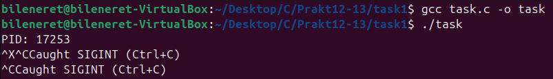
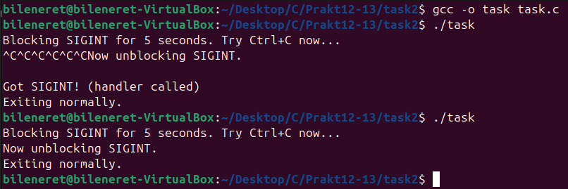
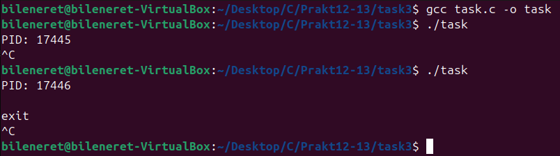
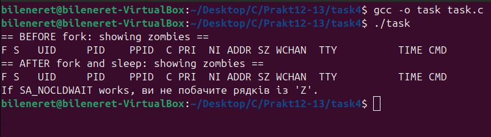
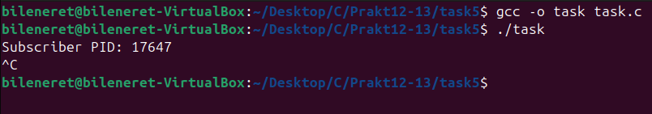
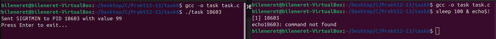
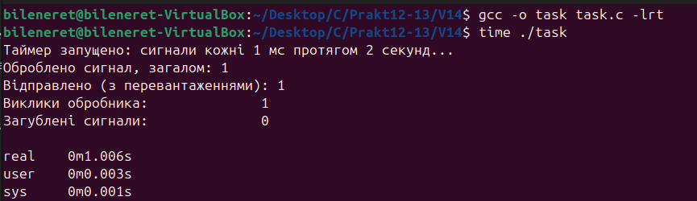

# ЗАВДАННЯ №1 З ЛЕКЦІЇ:

### Пояснення та опис програми:
Програма налаштовує обробку сигналів `SIGINT` і `SIGTERM`. Функція `signal(SIGINT, handle_sigint)` визначає обробник, який при натисканні `Ctrl+C` виводить "Caught SIGINT (Ctrl+C)". Функція `signal(SIGTERM, handle_sigterm)` реагує на сигнал `SIGTERM`, виводячи "Caught SIGTERM, exiting..." і завершуючи процес через `_exit(0)`. Після виведення PID програми за допомогою `getpid()`, вона входить у нескінченний цикл `sleep(1)`. Це дозволяє демонструвати перехоплення `SIGINT` із повідомленням і коректне завершення на `SIGTERM`, як показано на скриншоті.

### Результати:

### [Код завдання](task1/task.c)

---

# ЗАВДАННЯ №2 З ЛЕКЦІЇ:

### Пояснення та опис програми:
Програма на початку виводить "Blocking SIGINT for 5 seconds. Try Ctrl+C now..." і налаштовує обробник для `SIGINT`. Потім вона блокує сигнал `SIGINT` на 5 секунд за допомогою `sigprocmask(SIG_BLOCK, &set, NULL)`, ігноруючи натискання `Ctrl+C` протягом цього часу. Після цього виводиться "Now unblocking SIGINT.", сигнал розблоковується через `sigprocmask(SIG_UNBLOCK, &set, NULL)`, і обробник спрацьовує для всіх накопичених сигналів, виводячи "Got SIGINT! (handler called)" за кожним разом. Наприкінці, після 2-секундної паузи, програма виводить "Exiting normally." і завершується.

### Результати:

### [Код завдання](task2/task.c)

---

# ЗАВДАННЯ №3 З ЛЕКЦІЇ:

### Пояснення та опис програми:
Програма налаштовує обробку сигналу `SIGUSR1` через структуру `sigaction`, де обробник `handler` отримує номер сигналу, дані `siginfo_t` (зокрема PID відправника через `info->si_pid`) та контекст. Використовуються прапори `SA_SIGINFO` для доступу до детальної інформації та `SA_RESTART` для автоматичного відновлення системних викликів. Після виведення PID програми вона входить у цикл `pause()`, чекаючи сигналу. При отриманні `SIGUSR1` обробник виводить "Caught signal 10 from PID <PID>", де 10 — код `SIGUSR1`, а <PID> — ідентифікатор відправника, як показано на скриншоті.

### Результати:

### [Код завдання](task3/task.c)

---

# ЗАВДАННЯ №4 З ЛЕКЦІЇ:

### Пояснення та опис програми:
Програма конфігурує обробку сигналу `SIGCHLD`, ігноруючи його (`sa_handler = SIG_IGN`) з прапором `SA_NOCLDWAIT`, що дозволяє ядру автоматично очищати завершені дочірні процеси, уникаючи "зомбі". Спочатку виводиться список зомбі-процесів через `system("ps -l | grep Z")` до `fork()`. Потім створюється дочірній процес, який завершується одразу. Після паузи `sleep(1)` повторно перевіряється список зомбі. Якщо `SA_NOCLDWAIT` працює, зомбі не з’являються, що підтверджується скриншотом із відсутністю рядків зі статусом "Z".

### Результати:

### [Код завдання](task4/task.c)

---

# ЗАВДАННЯ №5 З ЛЕКЦІЇ:

### Пояснення та опис програми:
Програма функціонує як "підписник" сигналу `SIGRTMIN`, використовуючи `sigaction` із прапором `SA_SIGINFO` та обробником `handler`, який виводить номер сигналу, PID відправника (`info->si_pid`) та значення (`info->si_value.sival_int`). Після налаштування та виведення PID ("Subscriber PID: ...") програма входить у цикл `pause()`, чекаючи сигналу. При отриманні `SIGRTMIN` від іншого процесу (наприклад, через `sigqueue`), обробник показує деталі, як видно на скриншоті з відповідним виводом.

### Результати:

### [Код завдання](task5/task.c)

---

# ЗАВДАННЯ №6 З ЛЕКЦІЇ:

### Пояснення та опис програми:
Програма приймає PID іншого процесу як аргумент командного рядка, створює `union sigval` із значенням 99 і надсилає сигнал `SIGRTMIN` через `sigqueue(pid, SIGRTMIN, val)`. У разі успіху виводиться "Sent SIGRTMIN to PID <PID> with value 99", а при помилці — повідомлення через `perror`. Після цього програма чекає введення користувача (`getchar()`), дозволяючи переглянути результат перед завершенням, що відображено на скриншоті з відповідним виводом.

### Результати:

### [Код завдання](task6/task.c)

---

# ПЕРСОНАЛЬНЕ ЗАВДАННЯ, ВАРІАНТ №14:

## Умова: Напишіть програму, яка посилає реальні сигнали з таймером (timer_create) і аналізує, скільки з них реально оброблено, а скільки загублено.

### Пояснення та опис програми:
Програма використовує POSIX-таймер для генерації сигналу `SIGRTMIN` з інтервалом 10 мс протягом 2 секунд, створеного через `timer_create` із налаштуванням `itimerspec`. Обробник `signal_processor` відстежує кількість відправлених сигналів (враховуючи перевантаження через `timer_getoverrun`) та оброблених викликів, виводячи поточну статистику під час роботи. Після 2 секунд роботи таймер зупиняється за допомогою `timer_settime`, надається додаткова секунда для завершення обробки, після чого виводяться підсумки: загальна кількість сигналів (з урахуванням перевантажень), кількість викликів обробника та кількість загублених сигналів. Це дозволяє оцінити ефективність обробки сигналів у системі, як продемонстровано на скриншоті.

### Результати:

### [Код завдання](V14/task.c)

---

