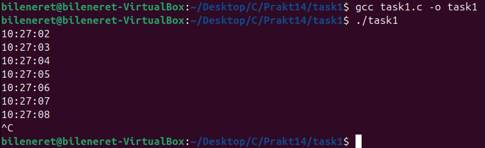
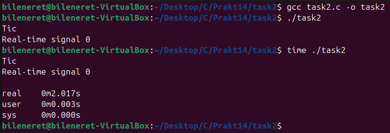
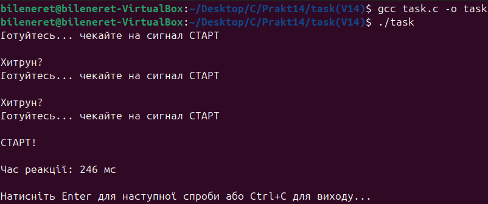

# ЗАВДАННЯ З ЛЕКЦІЇ №1:

### Пояснення та опис програми:
Ця програма щосекунди виводить поточний час у форматі `ГГ:ХХ:СС`. У функції `main()` встановлюється обробник сигналу `SIGALRM` за допомогою `signal(SIGALRM, handler)` та одразу запускається односекундний таймер через `alarm(1)`. Основний цикл програми використовує `pause()`, щоб очікувати на сигнал. Коли сигнал надходить, функція `handler()` викликається: вона отримує поточний час (`time()` + `localtime()`), форматований рядок створюється за допомогою `strftime()`, а потім виводиться через `write()`. Після кожного виклику `handler()` сигнал `SIGALRM` знову перезапускається (`alarm(1)`), що забезпечує періодичність.

### Результати:

### [Код завдання](task1/task1.c)

---

# ЗАВДАННЯ З ЛЕКЦІЇ №2:

### Пояснення та опис програми:
Ця програма демонструє використання високоточних POSIX-таймерів. Обробник сигналу встановлюється для `SIGRTMIN` — першого реального сигналу. За допомогою `timer_create()` створюється таймер, який надсилає сигнал `SIGRTMIN` кожну секунду. Структура `itimerspec` задає першу затримку та інтервал у 1 секунду. Обробник сигналу просто виводить "Tic" у новому рядку за допомогою `write()`. Основна програма після налаштування таймера переходить у нескінченний цикл `pause()`, очікуючи сигнали. Таким чином, на екрані щосекунди з’являється "Tic".

### Результати:

### [Код завдання](task2/task2.c)

---

# ПЕРСОНАЛЬНЕ ЗАВДАННЯ. ВАРІАНТ 14:

## Умова:
Створити гру-реакцію (reaction time game), яка вимірює час реакції користувача на появу сигналу.

### Пояснення та опис програми:
Ця програма імітує гру на швидкість реакції. Спочатку вона виводить повідомлення «Готуйтесь... чекайте на сигнал СТАРТ», після чого встановлює сигнал `SIGALRM` з випадковою затримкою 2–5 секунд. Програма у циклі очікує або на сигнал `SIGALRM`, або на натискання Enter користувачем. Якщо користувач натисне Enter до сигналу — виводиться повідомлення «Хитрун?» і гра починається заново. Коли сигнал `SIGALRM` спрацьовує, на екрані зʼявляється «СТАРТ!», і починається відлік часу. Як тільки користувач натискає Enter, фіксується час реакції у мілісекундах. Гра повторюється, дозволяючи перевірити себе ще раз.

### Результати:

### [Код завдання](V14/task.c)

