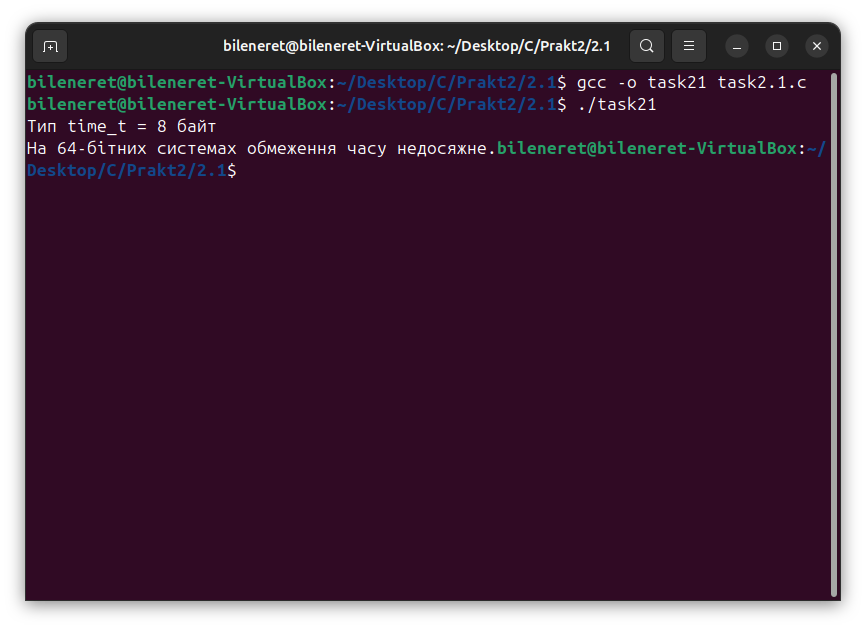
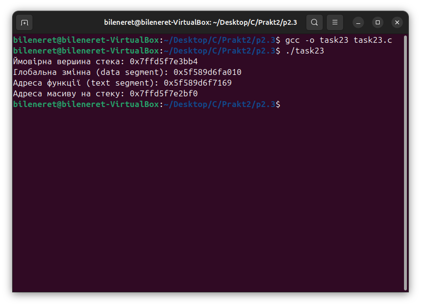
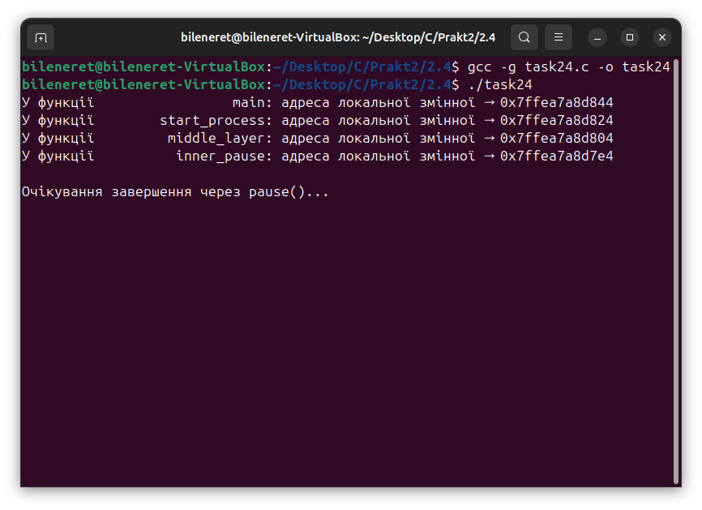
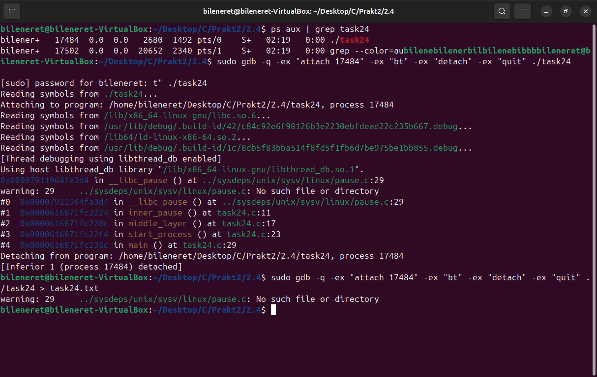
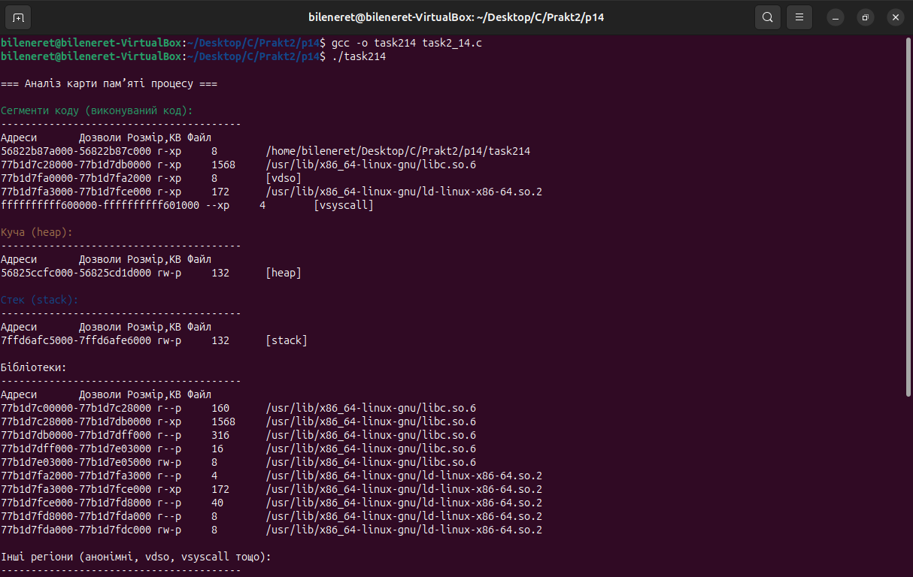
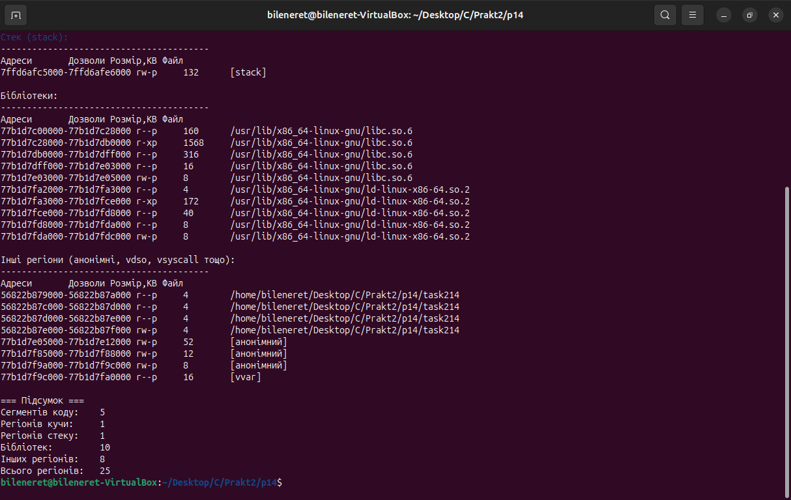

# ЗАВДАННЯ 1:

## Умова:

Напишіть програму для визначення моменту, коли time_t закінчиться.Дослідіть, які зміни відбуваються в залежності від 32- та64-бітної архітектури. Дослідіть сегменти виконуваного файлу.


### Пояснення та опис програми:

Програма визначає розмір типу time_t і виводить його в байтах. Для 32-бітної системи (time_t = 4 байти) показує дату межі часу (0x7FFFFFFF, 19 січня 2038 року) за допомогою ctime. Для 64-бітної системи зазначає, що обмеження часу недосяжне.

Залежність від архітектури:

    32-біт: межа часу — 2038 рік, можливе переповнення до 1901 року.
    64-біт: межа у 292 мільярди років, проблема відсутня.

### [Код завдання](2.1/task2.1.c)

### Результати:




# ЗАВДАННЯ 2:

## Умова:

Розгляньте сегменти у виконуваному файлі.
### 1. Скомпілюйте програму &quot;hello world&quot;, запустіть ls -l для виконуваного файлу, щоб отримати його загальний розмір, і запустіть size, щоб отримати розміри сегментів всередині нього.

#### [Код завдання](2.2/task221.c)
#### [Результат](2.2/task221.png)

### Пояснення програми 1:

Спочатку компілюєте “hello world”, дивитесь ls і size – сегменти .data й .bss пусті. Додаєте глобальний масив без ініціалізації – зростає BSS у size, але файл не збільшується. Ініціалізований масив переходить у .data, і файл більшає. Локальні масиви впливають лише на стек. -g додає дебаг, -O2 зменшує текст.

### 2. Додайте оголошення глобального масиву із 1000 int, перекомпілюйте й повторіть вимірювання. Зверніть увагу на відмінності.


#### [Код завдання](2.2/task222.c)
#### [Результат](2.2/task222.png)
### Пояснення програми 2:

Коли ви оголошуєте глобальний масив без ініціалізації, він потрапляє до сегмента BSS, який не зберігається в бінарному файлі, а лише резервується під час запуску. Тому розмір виконуваного файлу майже не змінюється, однак обсяг оперативної пам’яті, необхідний для виконання, зростає відповідно до розміру масиву. При завантаженні ОС виділяє й зануляє пам’ять.

### 3. Тепер додайте початкове значення в оголошення масиву (пам’ятайте, що C не змушує вас вказувати значення для кожного елемента масиву в ініціалізаторі). Це перемістить масив із сегмента BSS у сегмент даних. Повторіть вимірювання. Зверніть увагу на різницю.

#### [Код завдання](2.2/task223.c)
#### [Результат](2.2/task223.png)
### Пояснення програми 3:

Коли глобальний масив оголошується з початковими значеннями, він переходить із сегмента .bss у сегмент .data. Сегмент .data фізично зберігається в бінарному файлі, тому розмір виконуваного файлу зростає на загальний обсяг даних масиву. При завантаженні ОС виділяє пам’ять та ініціалізує її заданими значеннями. Це можна підтвердити командою size, де зросте показник .data і зменшиться .bss до нуля.

### 4. Тепер додайте оголошення великого масиву в локальну функцію. Оголосіть другий великий локальний масив з ініціалізатором. Повторіть вимірювання. Дані розташовуються всередині функцій,залишаючись у виконуваному файлі? Яка різниця, якщо масив ініціалізований чи ні?

#### [Код завдання](2.2/task224.c)
#### [Результат](2.2/task224.png)
### Пояснення програми 4:

Локальні масиви завжди розміщуються в стеку під час виконання, незалежно від того, ініціалізовані вони чи ні. Непочатковий arr1 просто резервує місце в стековому кадрі. Для arr2 компілятор згенерує інструкції, які при запуску заповнять перший елемент значенням 1, а решту обнулать, але самі дані не «лежать» у сегменті .data. Через це розмір бінарника змінюється не через новий сегмент, а лишень трохи зростає код ініціалізації в текстовому сегменті

### 5. Які зміни відбуваються з розмірами файлів і сегментів, якщо ви компілюєте для налагодження? Для максимальної оптимізації?

#### [Результат](2.2/task225.png)
### Пояснення програми 5:

При компіляції з опцією налагодження (`-g`) до бінарника додається велика кількість символів і структур для дебагу, тому розмір файлу суттєво зростає, хоча сегменти `.text`, `.data` та `.bss` залишаються тих самих розмірів. З іншого боку, увімкнення максимальної оптимізації (`-O3`) дозволяє компілятору вичавити зайві інструкції та скоротити текстовий сегмент, але обсяги сегментів даних і BSS не змінюються. Локальні масиви, незалежно від ініціалізації, розгортаються в стеку під час виконання й не впливають на розміри виконуваного файлу.

Проаналізуйте результати, щоб переконатися, що:

● сегмент даних зберігається у виконуваному файлі;

● сегмент BSS не зберігається у виконуваному файлі (за винятком примітки щодо його вимог до розміру часу виконання);

● текстовий сегмент більшою мірою піддається перевіркам оптимізації;

● на розмір файлу a.out впливає компіляція для налагодження, але не сегменти.


# ЗАВДАННЯ 3:

## Умова:

Скомпілюйте й запустіть тестову програму, щоб визначити приблизне розташування стека у вашій системі:
```c
#include <stdio.h>

int main() {
        int i;
        printf(&quot;The stack top is near %p\n&quot;, &amp;i);
        return 0;
}
```
Знайдіть розташування сегментів даних і тексту, а також купи всередині сегмента даних, оголосіть змінні, які будуть поміщені в ці сегменти, і виведіть їхні адреси. Збільшіть розмір стека, викликавши функцію й оголосивши кілька великих локальних масивів. Яка зараз адреса вершини стека?

*Примітка*: стек може розташовуватися за різними адресами на різних архітектурах та різних ОС. Хоча ми говоримо про вершину стека, на більшості процесорів стек зростає вниз, до пам’яті з меншими значеннями адрес.

### [Код завдання](2.3/task23.c)

### Результати:



### Пояснення програми:

Код досліджує розташування різних сегментів пам’яті. Адреса функції `func` показує текстовий сегмент (зберігає машинний код програми). Глобальна змінна `x` з ініціалізацією належить до сегмента DATA, а неініціалізована глобальна змінна `y` — до сегмента BSS. Виділення пам’яті через `malloc` демонструє розташування купи, а адреса локальної змінної `z` показує місце стека. Програма допомагає зрозуміти, як пам’ять організована і використовується різними сегментами.

# ЗАВДАННЯ 4:

## Умова:

Ваше завдання – дослідити стек процесу або пригадати, як це робиться. Ви
можете:

● Автоматично за допомогою утиліти gstack.

● Вручну за допомогою налагоджувача GDB.


## Пояснення програми:

Ця програма демонструє вкладеність викликів: з main вона переходить у start_process, потім у middle_layer і нарешті в inner_pause, виводячи адресу локальної змінної кожної функції через макрос INFO_MSG. У inner_pause виконання зупиняється на pause, чекаючи сигналу. Для аналізу стеку процесу можна використати procstat для швидкого знімка кадрів стеку всіх потоків. Альтернативно, GDB забезпечує інтерактивний доступ: дозволяє переглядати стек (як показано у task24.txt), перевіряти значення змінних і виконувати покроковий аналіз. Procstat — простий і швидкий, тоді як GDB — детальний інструмент для налагодження, що потребує більше знань.

### [Код завдання](2.4/task242.c)

### Результати:







# ЗАВДАННЯ ПО ВАРІАНТАХ (14 ВАРІАНТ):

## Умова:

14. Реалізуйте програму для аналізу вмісту /proc/self/maps.

### Пояснення програми:
Ця програма аналізує вміст файлу /proc/self/maps, виводячи інформацію про регіони пам’яті процесу з групуванням за типами (код, куча, стек, бібліотеки, інші). Використовує getopt для обробки аргументів -v (детальний вивід із зсувом, пристроєм, inode) та -h (довідка). Файл /proc/self/maps відкривається через fopen, рядки парсяться з допомогою sscanf, а регіони виводяться з кольоровим форматуванням (зелений — код, жовтий — куча, синій — стек) і підсумковою статистикою. Для аналізу стеку, як показано у зображенні, можна використовувати procstat для швидкого знімка або GDB для детального інтерактивного налагодження. Програма допомагає зрозуміти розподіл адрес і прав доступу в пам’яті процесу.

### [Код завдання](V14/task2_14.c)

### Результати:




