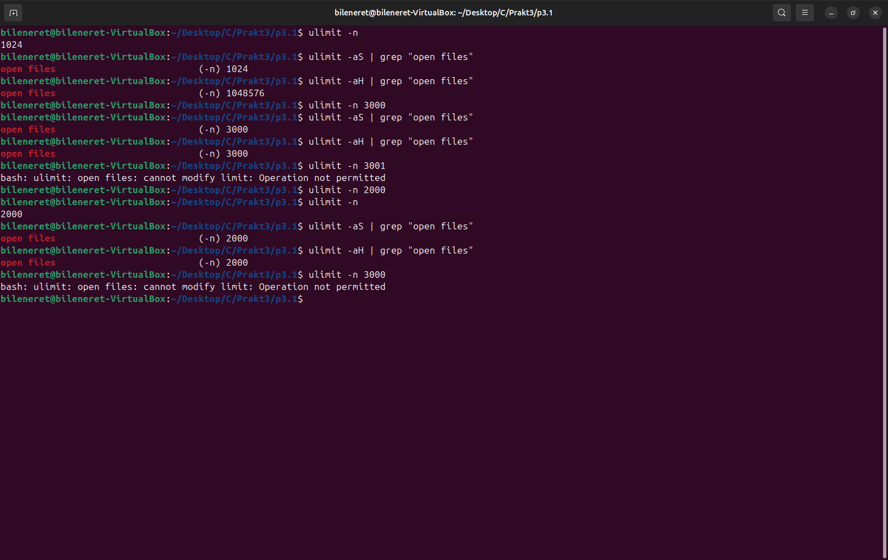
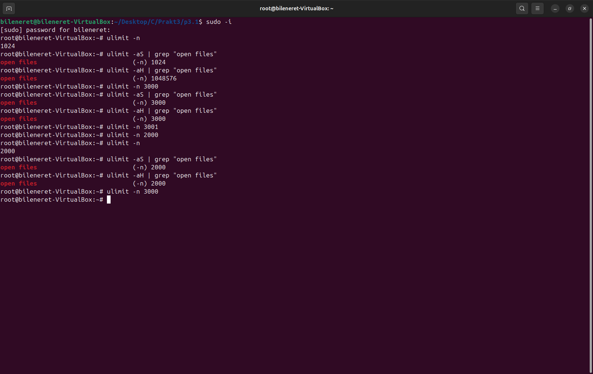
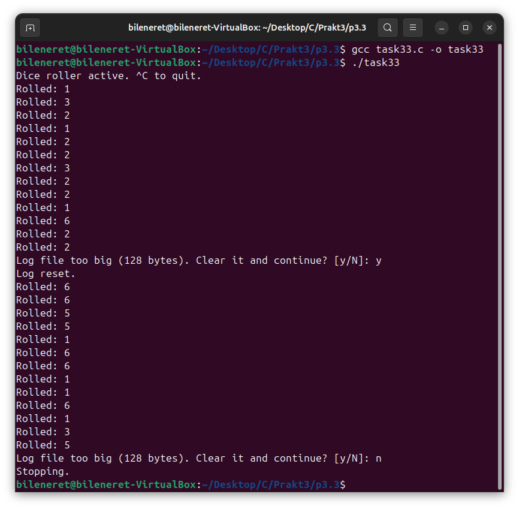
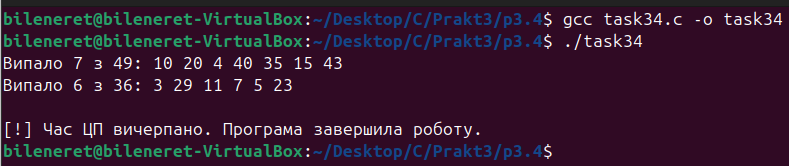

# ЗАВДАННЯ 1:

## Умова:

Запустіть Docker-контейнер і поекспериментуйте з максимальним лімітом ресурсів відкритих файлів. Для цього виконайте команди у вказаному порядку:

$ ulimit -n

$ ulimit -aS | grep "open files"

$ ulimit -aH | grep "open files"

$ ulimit -n 3000

$ ulimit -aS | grep "open files"

$ ulimit -aH | grep "open files"

$ ulimit -n 3001

$ ulimit -n 2000

$ ulimit -n

$ ulimit -aS | grep "open files"

$ ulimit -aH | grep "open files"

$ ulimit -n 3000

### Результати:

  

# ЗАВДАННЯ 3:

## Умова:

Напишіть програму, що імітує кидання шестигранного кубика. Імітуйте кидки, результати записуйте у файл, для якого попередньо встановлено обмеження на його максимальний розмір (max file size). Коректно обробіть ситуацію перевищення ліміту.

### Пояснення та опис програми:

Ця програма імітує нескінченне кидання шестигранного кубика та записує результати у файл `dice_log.txt`, обмежуючи його розмір 128 байтами через константу `MAX_LOG_BYTES`. Генератор випадкових чисел ініціалізується з `srand(time(NULL))`, а лог-файл відкривається у режимі додавання. Перед кожним записом перевіряється розмір файлу за допомогою `stat`: якщо ліміт перевищено, програма пропонує користувачеві очистити лог або завершити роботу. На скриншоті видно, що після кількох кидків ліміт був перевищений, користувач обрав «y» для очищення, отримавши «Log reset.», і кидки продовжилися. При повторному перевищенні лімиту вибір «n» завершив програму з повідомленням «Stopping.». Записи супроводжуються `fflush`, а пауза `usleep(100000)` забезпечує реальний час між кидками, дозволяючи відстежувати результати. Це дає контроль над розміром логу та гнучкість у його управлінні.

### Результати:

## [Код завдання](3.3/task33.c) 

# ЗАВДАННЯ 4:

## Умова:

Напишіть програму, що імітує кидання шестигранного кубика. Імітуйте кидки, результати записуйте у файл, для якого попередньо встановлено обмеження на його максимальний розмір (max file size). Коректно обробіть ситуацію перевищення ліміту.

### Пояснення та опис програми:

Ця програма симулює лотерею, генеруючи сім унікальних чисел від 1 до 49 та шість від 1 до 36, які виводяться на екран. Обмеження часу ЦП встановлюється на 2 секунди через `setrlimit(RLIMIT_CPU)`, а обробник сигналу `SIGXCPU` при перевищенні ліміту виводить "[!] Час ЦП вичерпано. Програма завершила роботу." і завершує роботу. Генерація чисел виконується функцією `generate_lottery` з унікальними значеннями за допомогою масиву `used`. На скриншоті видно результати: "Випало 7 з 49: 10 20 4 40 35 15 43" і "Випало 6 з 36: 3 29 11 7 5 23", після чого програма входить у нескінченний цикл. Оскільки обчислення займають мало часу, ліміт ЦП не спрацьовує, але механізм захищає від можливого зависання і завершає програму.

### Результати:

## [Код завдання](3.4/task34.c)

## ЗАВДАННЯ 5:

### Умова:
Напишіть програму для копіювання одного іменованого файлу в інший. Імена файлів передаються у вигляді аргументів. Програма має:

    перевіряти, чи передано два аргументи, інакше виводити "Program need two arguments";

    перевіряти доступність першого файлу для читання, інакше виводити "Cannot open file .... for reading";

    перевіряти доступність другого файлу для запису, інакше виводити "Cannot open file .... for writing";

    обробляти ситуацію перевищення обмеження на розмір файлу.

### Пояснення та опис програми:

Ця програма реалізує копіювання вмісту одного файла в інший із низкою перевірок на коректність і безпеку. Спочатку вона переконується, що отримано дві різні імена файлів як аргументи, і в іншому випадку виводить "Program need two arguments" або"Error: source and destination must be different". Далі за допомогою stat перевіряється, що файли не посилаються на той самий індексний дескриптор, після чого відкривається файл-джерело в режимі читання та файл-призначення в режимі запису. Копіювання здійснюється блоками по 1024 байти, а накопичуваний обсяг записаних даниз контролюється проти ліміту в 1 МБ. Якщо під час запису розмір файлу перевищує обмеження, програма виводить відповідну помилку й завершується .

На скрині видно успішне копіювання текстового файла "text.txt" у "text_new.txt" з відображенням вмісту після операції, а також правильне спрацьовування перевірки на однакові імена, коли вихідні та цільові файли співпадають. Такий підхід гарантує коректне й безпечне дублювання файлів.

### Результати:

## [Код завдання](task5/task5.c)

## ЗАВДАННЯ 6:

### Умова:
Напишіть програму, що демонструє використання обмеження (max stack segment size). Підказка: рекурсивна програма активно використовує стек.

### Пояснення та опис програми:

У цьому завданні я перевірив, як обмеження розміру сегмента стека впливає на глибину рекурсії. Спочатку через ulimit -s я побачив дефолтний ліміт у 8192 КБ, потім встановив його в 256 КБ і знову перевірив. Далі я скомпілював програму, яка в функції probe_stack на кожному рівні рекурсії оголошує локальний масив на 128 байт і виводить номер рівня і адресу маркера на стеку. Після запуску «Stack probing started…» програма друкує “Stack level: 1 (marker at 0x…)”, “Stack level: 2 …” і так далі. На скрині видно, що при глибині близько 1589 викликів рекурсія досягає межі й отримує Segmentation fault (core dumped). Це демонструє, що при активному використанні стека навіть невеликі обсяги локальних змінних швидко витрачають пам’ять, і обмеження ulimit -s реально зупиняє програму, захищаючи систему від неконтрольованого росту стеку.

### Результати:

## [Код завдання](task6/task6.c)

## ЗАВДАННЯ 7:

### Умова:
Запустити контейнер з різними значеннями ulimit та порівняти поведінку програм.
### Пояснення та опис програми:

На скріншотах видно  як обмеження розміру стекового сегмента впливає на глибину рекурсії. Програма probe_stack на кожному рівні виклику створює локальний масив на 128 байт і виводить номер рівня та адресу цього маркера. При старті без змін у ulimit -s стек становив близько 8 МБ, і програма досягла понад 52 000 вкладених викликів, перш ніж уперлася в межу, що видно на першому скриншоті з помилкою Segmentation fault. Коли ж перед запуском стек обмежили до 256 КБ, та сама реалізація завершилася аварією вже на 1 587 рівні, про що свідчить другий скріншот. Це чітко демонструє, що ліміт max stack segment size реально обмежує число рекурсивних викликів і споживання пам’яті в стеку.

### Результати:

## [Код завдання](task6/task6.c)
