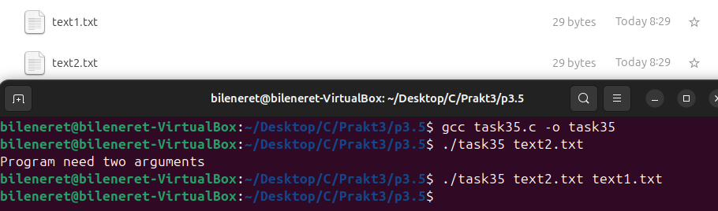
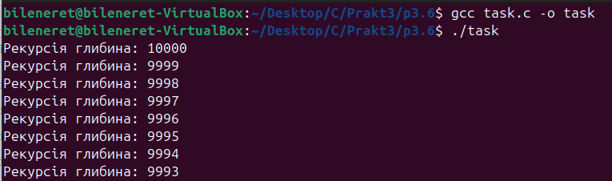
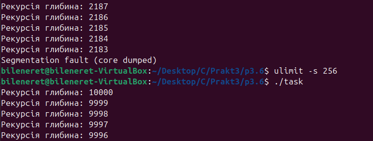
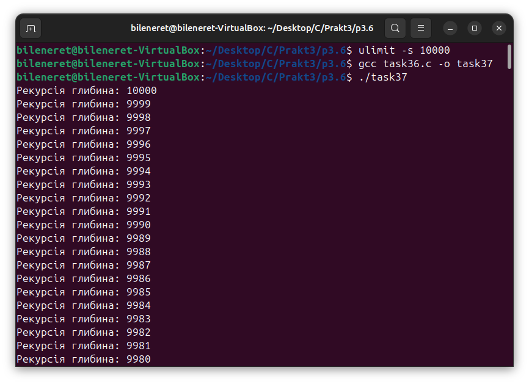
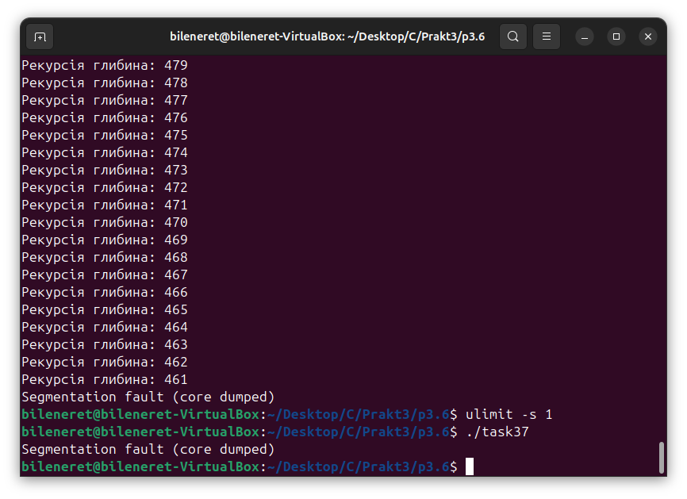

# ЗАВДАННЯ 1:

## Умова:

Запустіть Docker-контейнер і поекспериментуйте з максимальним лімітом ресурсів відкритих файлів. Для цього виконайте команди у вказаному порядку:

$ ulimit -n

$ ulimit -aS | grep "open files"

$ ulimit -aH | grep "open files"

$ ulimit -n 3000

$ ulimit -aS | grep "open files"

$ ulimit -aH | grep "open files"

$ ulimit -n 3001

$ ulimit -n 2000

$ ulimit -n

$ ulimit -aS | grep "open files"

$ ulimit -aH | grep "open files"

$ ulimit -n 3000

### Результати:

  

# ЗАВДАННЯ 3:

## Умова:

Напишіть програму, що імітує кидання шестигранного кубика. Імітуйте кидки, результати записуйте у файл, для якого попередньо встановлено обмеження на його максимальний розмір (max file size). Коректно обробіть ситуацію перевищення ліміту.

### Пояснення та опис програми:

Ця програма імітує нескінченне кидання шестигранного кубика та записує результати у файл `dice_log.txt`, обмежуючи його розмір 128 байтами через константу `MAX_LOG_BYTES`. Генератор випадкових чисел ініціалізується з `srand(time(NULL))`, а лог-файл відкривається у режимі додавання. Перед кожним записом перевіряється розмір файлу за допомогою `stat`: якщо ліміт перевищено, програма пропонує користувачеві очистити лог або завершити роботу. На скриншоті видно, що після кількох кидків ліміт був перевищений, користувач обрав «y» для очищення, отримавши «Log reset.», і кидки продовжилися. При повторному перевищенні лімиту вибір «n» завершив програму з повідомленням «Stopping.». Записи супроводжуються `fflush`, а пауза `usleep(100000)` забезпечує реальний час між кидками, дозволяючи відстежувати результати. Це дає контроль над розміром логу та гнучкість у його управлінні.

### Результати:

## [Код завдання](3.3/task33.c) 

# ЗАВДАННЯ 4:

## Умова:

Напишіть програму, що імітує кидання шестигранного кубика. Імітуйте кидки, результати записуйте у файл, для якого попередньо встановлено обмеження на його максимальний розмір (max file size). Коректно обробіть ситуацію перевищення ліміту.

### Пояснення та опис програми:

Ця програма симулює лотерею, генеруючи сім унікальних чисел від 1 до 49 та шість від 1 до 36, які виводяться на екран. Обмеження часу ЦП встановлюється на 2 секунди через `setrlimit(RLIMIT_CPU)`, а обробник сигналу `SIGXCPU` при перевищенні ліміту виводить "[!] Час ЦП вичерпано. Програма завершила роботу." і завершує роботу. Генерація чисел виконується функцією `generate_lottery` з унікальними значеннями за допомогою масиву `used`. На скриншоті видно результати: "Випало 7 з 49: 10 20 4 40 35 15 43" і "Випало 6 з 36: 3 29 11 7 5 23", після чого програма входить у нескінченний цикл. Оскільки обчислення займають мало часу, ліміт ЦП не спрацьовує, але механізм захищає від можливого зависання і завершає програму.

### Результати:

## [Код завдання](3.4/task34.c)

# ЗАВДАННЯ 5:

## Умова:
Напишіть програму для копіювання одного іменованого файлу в інший. Імена файлів передаються у вигляді аргументів. Програма має:

    перевіряти, чи передано два аргументи, інакше виводити "Program need two arguments";

    перевіряти доступність першого файлу для читання, інакше виводити "Cannot open file .... for reading";

    перевіряти доступність другого файлу для запису, інакше виводити "Cannot open file .... for writing";

    обробляти ситуацію перевищення обмеження на розмір файлу.

### Пояснення та опис програми:

Ця програма реалізує копіювання вмісту одного файлу в інший із базовими перевірками. Вона вимагає два аргументи — імена файлів-джерела та файлу-призначення; при їх відсутності виводиться "Program need two arguments". Функція `check_file_permission` перевіряє можливість читання з першого файлу та запису в другий, завершуючи роботу при помилках. Копіювання виконується блоками по 1024 байти з використанням `fread` і `fwrite`. На скриншоті видно компіляцію та запуск із файлами `text1.txt` і `text2.txt`, де вміст `text1.txt` (наприклад, "QWERTYUIOP\nLKJHGFDSA\nZXCVBNM") успішно копіюється в `text2.txt`. Програма забезпечує просте та надійне перенесення даних між файлами.

### Результати:

## [Код завдання](3.5/task35.c)

# ЗАВДАННЯ 6:

## Умова:
Напишіть програму, що демонструє використання обмеження (max stack segment size). Підказка: рекурсивна програма активно використовує стек.

### Пояснення та опис програми:

Ця програма демонструє вплив обмеження розміру сегмента стека на глибину рекурсії. У функції `recursive_function` на кожному рівні рекурсії оголошується локальний масив `buffer` розміром 1024 байти, а також виводиться поточна глибина рекурсії. Спочатку програма запускається з глибиною 10000, що значно перевищує типовий ліміт стека. На скриншотах видно, що після компіляції та запуску програма видає кілька рівнів рекурсії (наприклад, "Рекурсія глибина: 10000", "Рекурсія глибина: 9999" і т.д.), але швидко завершується з помилкою "Segmentation fault (core dumped)" при глибині близько 2187 (залежно від системи). Після зменшення ліміту стека до 256 КБ за допомогою `ulimit -s 256`, глибина рекурсії зменшується до приблизно 994, після чого також виникає "Segmentation fault". Це показує, що розмір стека, обмежений `ulimit -s`, критично впливає на максимальну глибину рекурсії, захищаючи систему від переповнення стека.

### Результати:

## [Код завдання](3.6/task36.c)

# ЗАВДАННЯ 7:

## Умова:
Запустити контейнер з різними значеннями ulimit та порівняти поведінку програм.

### Пояснення та опис програми:

Ця програма демонструє вплив обмеження розміру стекового сегмента на глибину рекурсії. У функції `recursive_function` на кожному рівні створюється локальний масив `buffer` розміром 1024 байти, а поточна глибина виводиться через `printf`. Аналізуючи скриншоти з різними значеннями `ulimit -s`, видно наступне:

- **Без значного обмеження (`ulimit -s 10000`)**: На першому скриншоті програма починає рекурсію з глибини 10000 і поступово зменшує її, досягаючи значень від 10000 до 9890, перш ніж завершитись. Другий скриншот показує продовження цього процесу, де глибина доходить до 461, після чого виникає "Segmentation fault (core dumped)". Це вказує на дефолтний ліміт стека (близько 8 МБ), який вичерпується через значний розмір буфера.
- **Обмеження 1 КБ (`ulimit -s 1`)**: На другому скриншоті після зміни ліміту на 1 КБ програма одразу завершується з "Segmentation fault (core dumped)" після першого виклику, не встигнувши вивести значну глибину рекурсії, що відображається як продовження виведення з попереднього запуску.

Таким чином, `ulimit -s` контролює максимальну глибину рекурсії, обмежуючи споживання стекової пам’яті. Значення 10000 дозволяє глибоку рекурсію до вичерпання стека, тоді як ліміт 1 КБ призводить до миттєвого збою через недостатній розмір стека для буфера 1024 байти.

## [Код завдання](3.6/task36.c)

### Результати:

