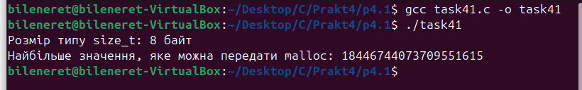
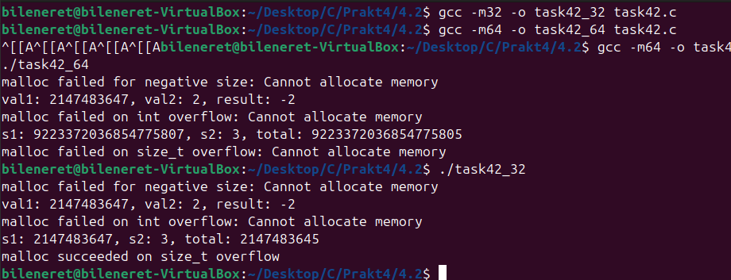
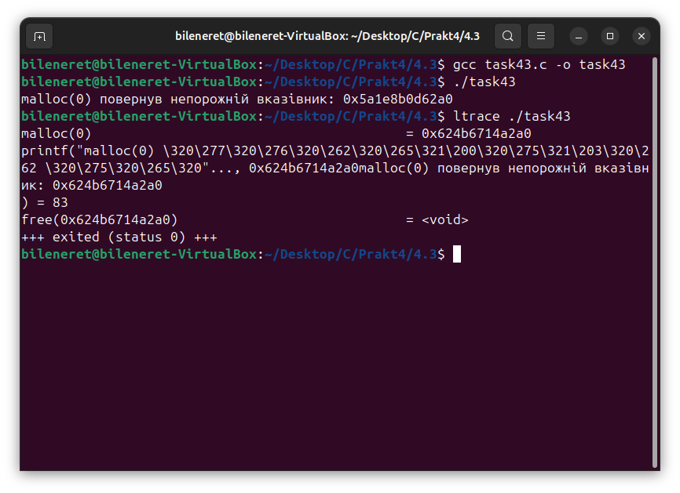
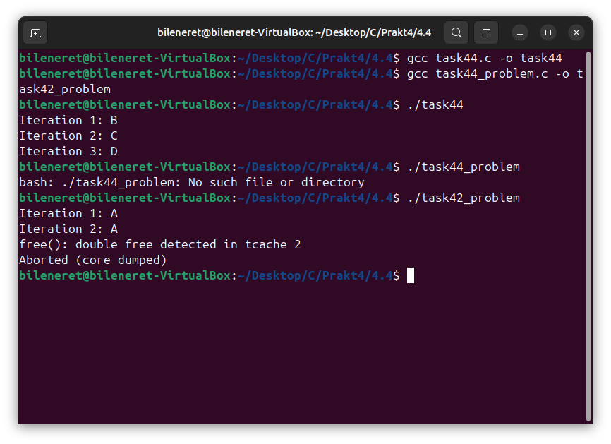
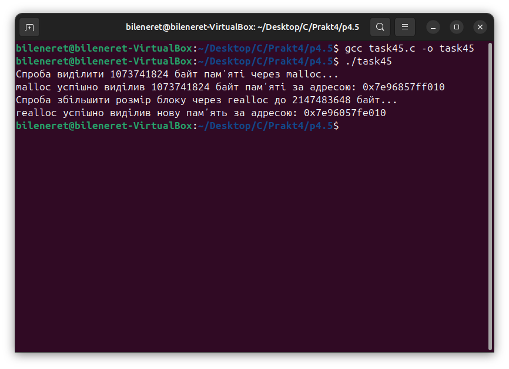
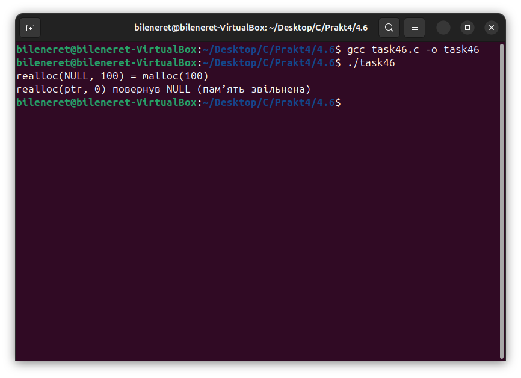
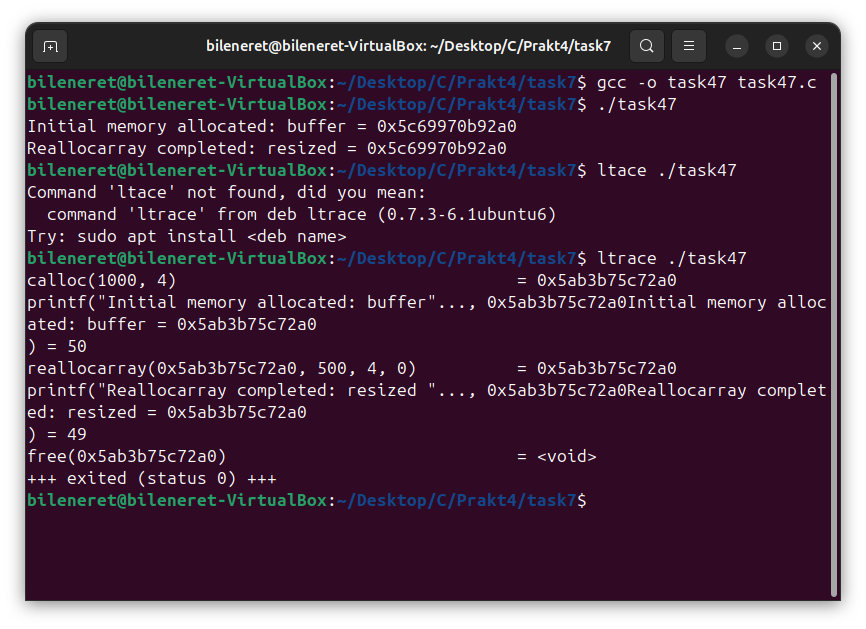
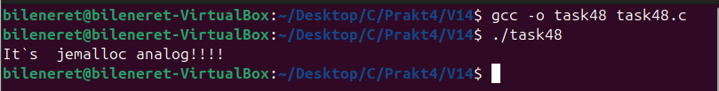

# ЗАВДАННЯ 1:

## Умова:

Скільки пам’яті може виділити `malloc(3)` за один виклик? Параметр `malloc(3)` є цілим числом типу даних `size_t`, тому логічно максимальне число, яке можна передати як параметр `malloc(3)`, — це максимальне значення `size_t` на платформі (sizeof(size_t)). У 64-бітній Linux `size_t` становить 8 байтів, тобто 8 * 8 = 64 біти. Відповідно, максимальний обсяг пам’яті, який може бути виділений за один виклик `malloc(3)`, дорівнює 2^64. Спробуйте запустити код на x86_64 та x86. Чому теоретично максимальний обсяг складає 8 ексабайт, а не 16?

### Пояснення та опис програми:

Ця програма (`task41.c`) перевіряє, скільки байтів можна запитати в одному виклику `malloc(3)`. Вона визначає розмір типу `size_t` за допомогою `sizeof(size_t)` і обчислює максимальне значення, яке можна передати в `malloc`, як `(size_t)(-1)`. Результати виводяться через `printf`. Програма не викликає сам `malloc` із максимальним значенням, а лише демонструє теоретичні межі. На практиці обмеження імплементації (наприклад, `ssize_t` або `off_t` із максимумом 2^63-1) і доступний адресний простір ОС пояснюють, чому реальний ліміт ближче до 8 ексабайт, а не 16.

### Результати:

## [Код завдання](4.1/task41.c)



# ЗАВДАННЯ 2:

## Умова:

Що станеться, якщо передати `malloc(3)` від’ємний аргумент? Напишіть тестовий випадок, який обчислює кількість виділених байтів за формулою `num = xa * xb`. Що буде, якщо `num` оголошено як цілочисельна змінна зі знаком, а результат множення призведе до переповнення? Як себе поведе `malloc(3)`? Запустіть програму на x86_64 і x86.

### Пояснення та опис програми:

Ця програма (`task42.c`) тестує поведінку `malloc(3)` при некоректних розмірах. Спочатку передається від’ємне значення `-1`, яке перетворюється в `size_t` як `SIZE_MAX`, викликаючи помилку через `perror` при поверненні `NULL`. Потім множаться `INT_MAX` і 2, що призводить до переповнення до `-2`, знову повертаючи `NULL`. Нарешті, із `size_t` обчислюється `total = (SIZE_MAX / 2) * 3`, що переповнює тип, і `malloc(total)` також повертає `NULL` із відповідним повідомленням. Результати демонструють, що `malloc` не захищає від переповнення, а великі запити завжди провалюються.

### Результати:

## [Код завдання](4.2/task42.c)



# ЗАВДАННЯ 3:

## Умова:

Що станеться, якщо використати `malloc(0)`? Напишіть тестовий випадок, у якому `malloc(3)` повертає `NULL` або вказівник, що не є `NULL`, і який можна передати у `free()`. Відкомпілюйте та запустіть через `ltrace`. Поясніть поведінку програми.

### Пояснення та опис програми:

Ця програма (`task43.c`) викликає `malloc(0)` і перевіряє результат: якщо повертається `NULL`, виводиться відповідне повідомлення, інакше — адреса вказівника, який потім звільняється через `free`. Тестування з `ltrace` показує, що в даній системі `malloc(0)` повертає валідний вказівник (наприклад, `0x220520c08008`), який безпечно передається в `free`. Це відповідає стандарту C, де `malloc(0)` може повернути `NULL` або спеціальний вказівник, придатний для звільнення.

### Результати:

## [Код завдання](4.3/task43.c)



# ЗАВДАННЯ 4:

## Умова:

Чи є помилки у такому коді?

```c
void *ptr = NULL;
while (<some-condition-is-true>) {
    if (!ptr)
        ptr = malloc(n);
    [... <використання 'ptr'> ...]
    free(ptr);
}
```

Напишіть тестовий випадок, який продемонструє проблему та правильний варіант коду.

### Пояснення та опис програми:

Ця програма порівнює три підходи. У `task44_problem.c` після першого `free(ptr)` вказівник залишається ненульовим, і повторні ітерації не викликають `malloc`, що призводить до некоректного використання. У `task44.c` показано коректний варіант: виділяється пам’ять один раз, використовується в циклі, і звільняється лише в кінці. Проблема `use-after-free` ілюструється неправильним кодом, де після `free` звертаються до `ptr`, що є невизначеною поведінкою. Правильний підхід вимагає скидання `ptr` до `NULL` після `free` для повторного виділення.

### Результати:

## [Код завдання](4.4/task44.c) (4.1 Початковий код)  
## [Код завдання](4.4/task44_problem.c) (4.2 Код з помилками)  



# ЗАВДАННЯ 5:

## Умова:

Що станеться, якщо `realloc(3)` не зможе виділити пам’ять? Напишіть тестовий випадок, що демонструє цей сценарій.

### Пояснення та опис програми:

Ця програма (`task45.c`) спочатку виділяє 1 ГБ через `malloc` і виводить адресу. Потім викликає `realloc` для збільшення до 2 ГБ. Якщо `realloc` повертає `NULL`, програма зберігає старий указатель `ptr` і звільняє його. У системах із overcommit `realloc` може повернути новий указатель, але при спробі використання (наприклад, запису) процес може бути завершений із "Killed" через нестачу пам’яті. Це демонструє необхідність перевірки результату `realloc`.

### Результати:

## [Код завдання](4.5/task45.c)



# ЗАВДАННЯ 6:

## Умова:

Якщо `realloc(3)` викликати з `NULL` або розміром 0, що станеться? Напишіть тестовий випадок.

### Пояснення та опис програми:

Ця програма (`task46.c`) тестує два випадки. Спочатку `realloc(NULL, 100)` еквівалентно `malloc(100)` і повертає валідний указатель, який звільняється. Потім `realloc(ptr, 0)` звільняє пам’ять і може повернути `NULL` або новий вказівник (залежно від реалізації `glibc`), що також придатний для `free`. Результати показують коректну обробку обох сценаріїв відповідно до стандарту C.

### Результати:

## [Код завдання](4.6/task46.c)



# ЗАВДАННЯ 7:

## Умова:

Перепишіть наступний код, використовуючи `reallocarray(3)`:

```c
struct sbar *ptr, *newptr;
ptr = calloc(1000, sizeof(struct sbar));
newptr = realloc(ptr, 500*sizeof(struct sbar));
```

Порівняйте результати виконання з використанням `ltrace`.

### Пояснення та опис програми:

Ця програма (`task47.c`) використовує `calloc` для виділення пам’яті під 1000 структур, а потім `reallocarray` для зміни розміру до 500 структур із захистом від переповнення. `ltrace` показує виклики `calloc(1000, sizeof(struct sbar))` і `reallocarray(500, sizeof(struct sbar))`, підтверджуючи коректність зміни розміру. Адреса буфера може залишатися незмінною, що ілюструє безпечне управління пам’яттю.

### Результати:

## [Код завдання](4.7/task47.c)



# ЗАВДАННЯ 8 (14 варіант):

## Умова:

Перепишіть `malloc` на основі `jemalloc`.

### Пояснення та опис програми:

Ця програма (`task48.c`) імітує використання `jemalloc` через макроси `#ifdef USE_JEMALLOC`, де `xmalloc` і `xfree` переключаються між `je_malloc`/`je_free` (заглушки над `libc`) і стандартними `malloc`/`free`. У `main` виділяється 64 байти, формується рядок із тегом ("jemalloc analog" без бібліотеки), і виводиться результат. Це дозволяє легко замінити механізм виділення пам’яті без зміни коду.

### Результати:

## [Код завдання](V14/task48.c)


