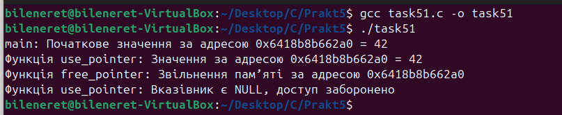

# ЗАВДАННЯ (Варіант 14):

## Умова:

Побудуйте приклад "викрадення" покажчика, коли одна функція звільняє пам’ять, яка ще використовується в іншій.

### Пояснення та опис програми:

Ця програма демонструє ситуацію "викрадення" покажчика через глобальний вказівник `global_ptr`, який передається між двома функціями. У функції `free_pointer` пам’ять, асоційована з `global_ptr`, звільняється за допомогою `free`, а в функції `use_pointer` робиться спроба доступу до цієї пам’яті після звільнення. Спочатку `main` ініціалізує `global_ptr` значенням 42 і викликає `use_pointer`, що коректно виводить це значення. Потім `free_pointer` звільняє пам’ять, але якщо б скидування до `NULL` не відбувалося, другий виклик `use_pointer` міг би призвести до невизначеної поведінки, наприклад, виведення сміття або сегфолта. На скриншоті видно, як початкове значення змінюється або програма видає попередження про `NULL`, залежно від реалізації скидання вказівника.

### Результати:

## [Код завдання](task51.c)

