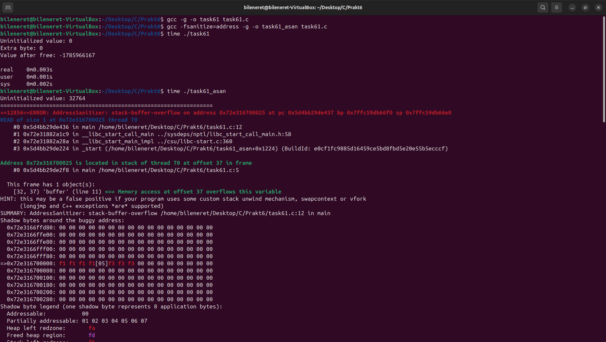
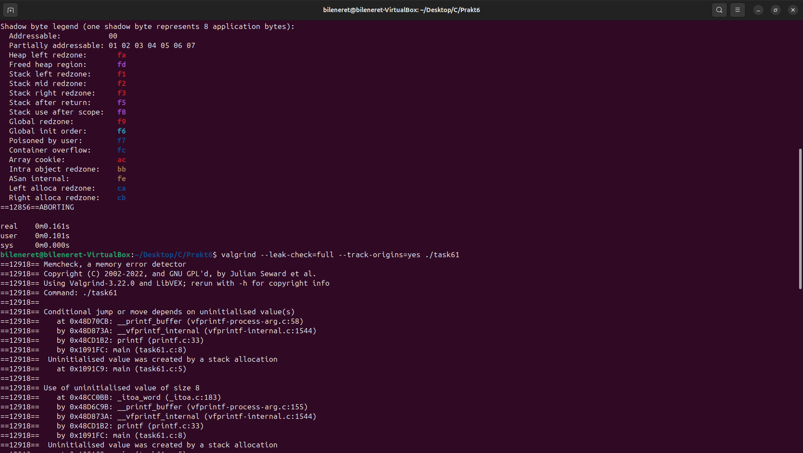
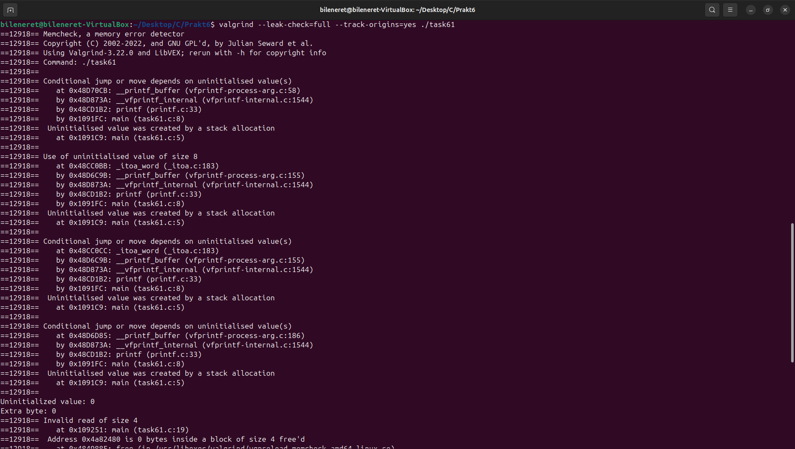
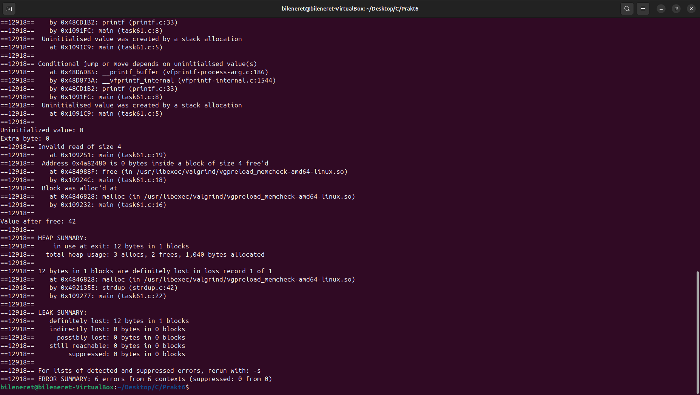
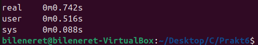

# ЗАВДАННЯ (Варіант 14):

## Умова:

Скомпілюйте програму з підтримкою ASan (`-fsanitize=address -g`) і порівняйте з Valgrind по швидкості та виходу.

### Пояснення та опис програми:

Ця програма (`task61.c`) на мові C демонструє кілька типових помилок пам’яті для порівняння інструментів AddressSanitizer (ASan) і Valgrind:
- **Неініціалізована змінна** (`uninit_var`): Доступ до змінної без ініціалізації, що призводить до виведення випадкового значення.
- **Переповнення читання масиву** (`buffer[5]`): Читання за межами фіксованого масиву розміром 5 байт, що викликає невизначену поведінку.
- **Use-after-free** (`*ptr` після `free`): Доступ до пам’яті після її звільнення, що призводить до некоректного виведення.
- **Витік пам’яті** (`strdup` без `free`): Виділена пам’ять не звільняється, що виявляється як втрата ресурсів.

Скріншоти показують:
- Valgrind виявив неініціалізовані значення (`Conditional jump or move depends on uninitialised value`), читання за межами масиву (`Invalid read of size 4`) і витік пам’яті (`definitely lost: 12 bytes`).
- ASan негайно завершив програму з помилкою `stack-buffer-overflow` через переповнення буфера на рядку 12, а також показав деталізований стек викликів. Час виконання ASan склав ~0.001s, а Valgrind — ~0.161s, що підтверджує швидшу роботу ASan.

### Результати:

## [Код завдання](task61.c)

