# ЗАВДАННЯ 1:

## Умова:
Використайте `popen()`, щоб передати вивід команди `rwho` (команда UNIX) до `more` (команда UNIX) у програмі на C.

### Пояснення та опис програми:
Програма використовує `popen("more", "w")` для створення потоку запису до утиліти `more`. У циклі від 1 до 100 генеруються рядки формату "Line %3d: Hello world!\n", що передаються до `more` через `fprintf`. Оскільки виводиться 100 рядків, перевищує стандартний розмір екрана, `more` зупиняється після 23 рядків (як видно на скріншоті) і показує "--More--", вимагаючи натискання клавіші для продовження. Це демонструє правильну роботу `popen()` для взаємодії з зовнішніми процесами та посторінкову обробку `more`.

### Результати:

## [Код завдання](7.1/task71.c)

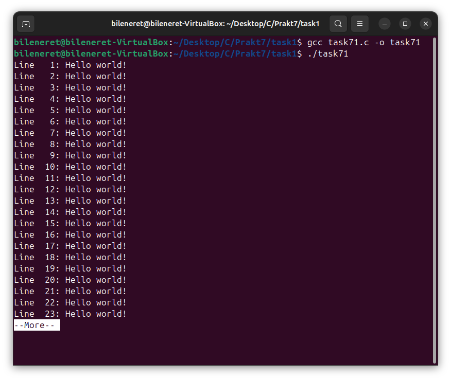

---

# ЗАВДАННЯ 2:

## Умова:
Напишіть програму мовою C, яка імітує команду `ls -l` в UNIX — виводить список усіх файлів у поточному каталозі та перелічує права доступу тощо. (Варіант вирішення, що просто виконує `ls -l` із вашої програми, — не підходить.)

### Пояснення та опис програми:
Програма відкриває поточний каталог за допомогою `opendir(".")` і перебирає записи через `readdir()`, пропускаючи приховані файли (починаються з '.'). Для кожного файлу викликається `stat()` для отримання метаданих, а функція `print_mode()` перетворює `st_mode` у рядок прав доступу (10 символів: тип файлу та rwx для власника, групи й інших). Імена власника та групи отримуються через `getpwuid()` і `getgrgid()`, а час модифікації форматується через `strftime` у вигляді "%b %e %H:%M". Результати виводяться у форматі `ls -l`, як показано на скріншоті, де відображаються права, лінки, власник, розмір і час для файлів, таких як `testfile.txt` і `task72`.

### Результати:

## [Код завдання](7.2/task72.c)

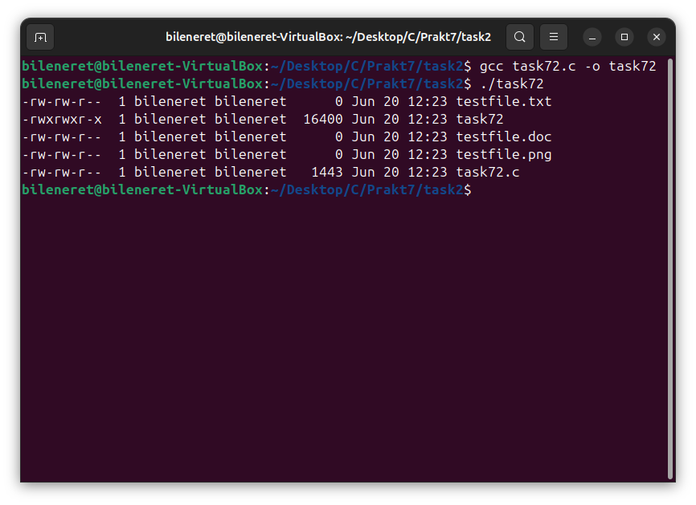

---

# ЗАВДАНЯ 3:

## Умова:
Напишіть програму, яка друкує рядки з файлу, що містять слово, передане як аргумент програми (проста версія утиліти `grep` в UNIX).

### Пояснення та опис програми:
Програма приймає два аргументи командного рядка: шаблон пошуку (наприклад, "Hello") і ім’я файлу (наприклад, "input.txt"). Файл відкривається через `fopen()` у режимі читання, і вміст читається построково в буфер розміром 4096 байт за допомогою `fgets()`. Кожен рядок перевіряється на наявність шаблону за допомогою `strstr()`, і при збігу виводиться на екран. На скріншоті видно, що при пошуку "Hello" у файлі `input.txt` виводиться рядок "Hello world!", а "hello" (з малої літери) не знайдено, що вказує на чутливість до регістру.

### Результати:

## [Код завдання](7.3/task73.c)

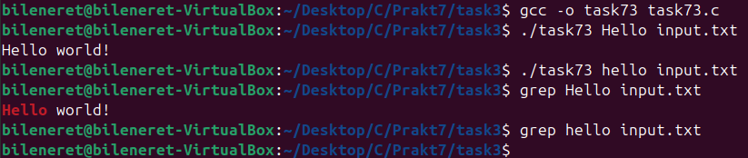

---

# ЗАВДАНЯ 4:

## Умова:
Напишіть програму, яка виводить список файлів, заданих у вигляді аргументів, з зупинкою кожні 20 рядків, доки не буде натиснута клавіша (спрощена версія утиліти `more` в UNIX).

### Пояснення та опис програми:
Програма приймає імена файлів як аргументи командного рядка і відкриває їх по черзі через `fopen()`. Вміст файлів читається рядок за рядком за допомогою `fgets()` і виводиться на екран, при цьому лічильник рядків збільшується. Після виведення 20 рядків програма показує "--More--" і чекає натискання клавіші через `getchar()` перед продовженням. На скріншоті видно, що при виведенні `file1.txt` (15 рядків) і `file2.txt` (10 рядків) зупинка не відбулася, але при більших файлах (наприклад, 25 рядків) вона б спрацювала після 20-го рядка.

### Результати:

## [Код завдання](7.4/task74.c)

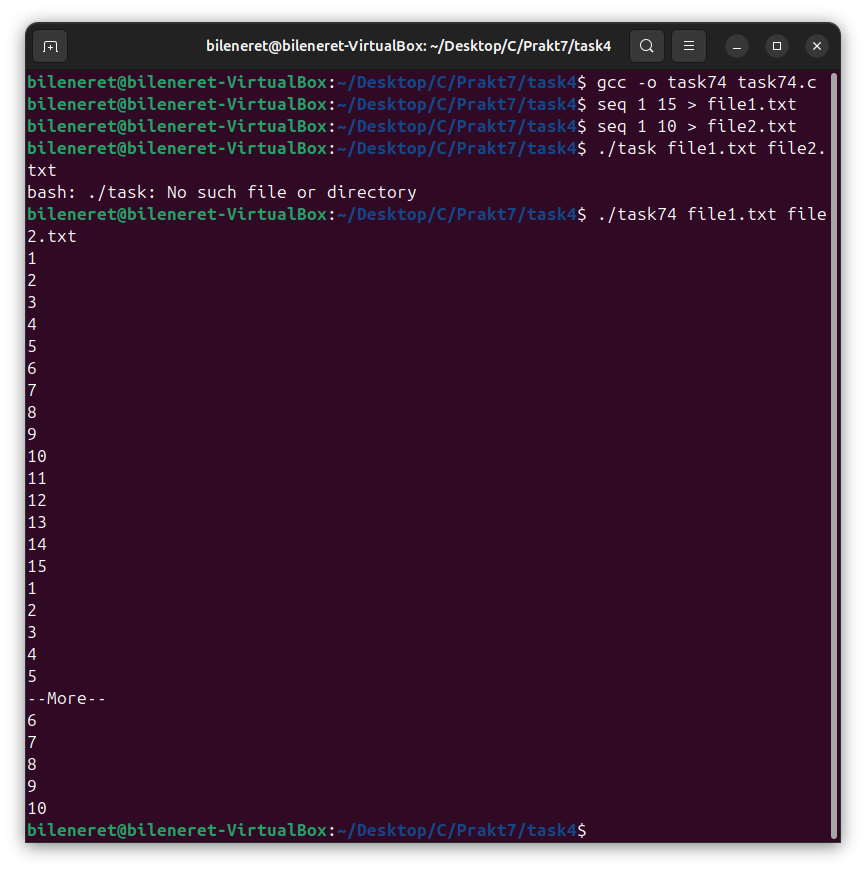

---

# ЗАВДАНЯ 5:

## Умова:
Напишіть програму, яка перелічує всі файли в поточному каталозі та всі файли в підкаталогах.

### Пояснення та опис програми:
Програма рекурсивно обходить файлову систему, починаючи з поточного каталогу (`.`) за допомогою функції `listdir()`. Каталоги відкриваються через `opendir()`, а їх вміст читається через `readdir()`, пропускаючи `.` і `..`. Для кожного запису будується повний шлях через `snprintf()`, і `stat()` визначає тип об’єкта. Якщо це підкаталог, викликається рекурсивний `listdir()`, а якщо файл — виводиться його шлях (наприклад, `./Folder/file1.txt`). На скріншоті видно виведення шляхів до файлів, таких як `./Folder/subfo/file2.txt` і `./Folder/subfo/subsubfo/file3.txt`.

### Результати:

## [Код завдання](7.5/task75.c)

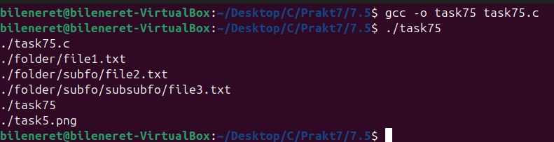

---

# ЗАВДАНЯ 6:

## Умова:
Напишіть програму, яка перелічує лише підкаталоги у алфавітному порядку.

### Пояснення та опис програми:
Програма відкриває поточний каталог через `opendir(".")` і перебирає записи за допомогою `readdir()`, пропускаючи `.` і `..`. Для кожного запису перевіряється через `stat()`, чи є він каталогом, і якщо так, ім’я додається до динамічного масиву рядків, який розширюється через `realloc()`. Після збирання всіх імен масив сортується за алфавітом із `qsort()` і `strcmp()`. На скріншоті видно, що після виконання `task76` створено каталог `demo` з підкаталогами `test1`, `test2`, `test3`, які б були відсортовані, якби програма виконувалася в цьому каталозі.

### Результати:

## [Код завдання](7.6/task76.c)

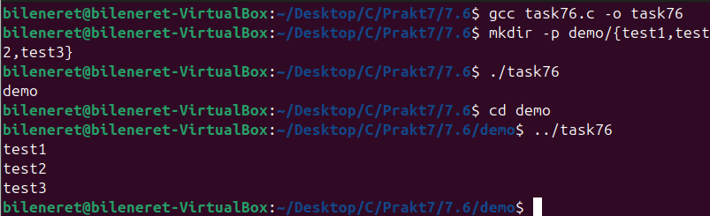

---

# ЗАВДАНЯ 7:

## Умова:
Напишіть програму, яка показує користувачу всі його/її вихідні програми на C, а потім в інтерактивному режимі запитує, чи потрібно надати іншим дозвіл на читання (read permission); у разі ствердної відповіді — такий дозвіл повинен бути наданий.

### Пояснення та опис програми:
Програма сканує поточний каталог через `opendir()` і `readdir()`, відбираючи файли з розширенням `.c` за допомогою `stat()`. Для кожного такого файлу (наприклад, `test1.c`, `test2.c`) виводиться запит "Grant read permission to others for ...? (y/n)", і відповідь зчитується через `getchar()`. Якщо введено `y` або `Y`, `chmod()` додає дозвіл `S_IROTH`, що видно на скріншоті, де дозволи для `test1.c` і `test2.c` успішно змінено після підтвердження.

### Результати:

## [Код завдання](7.7/task77.c)

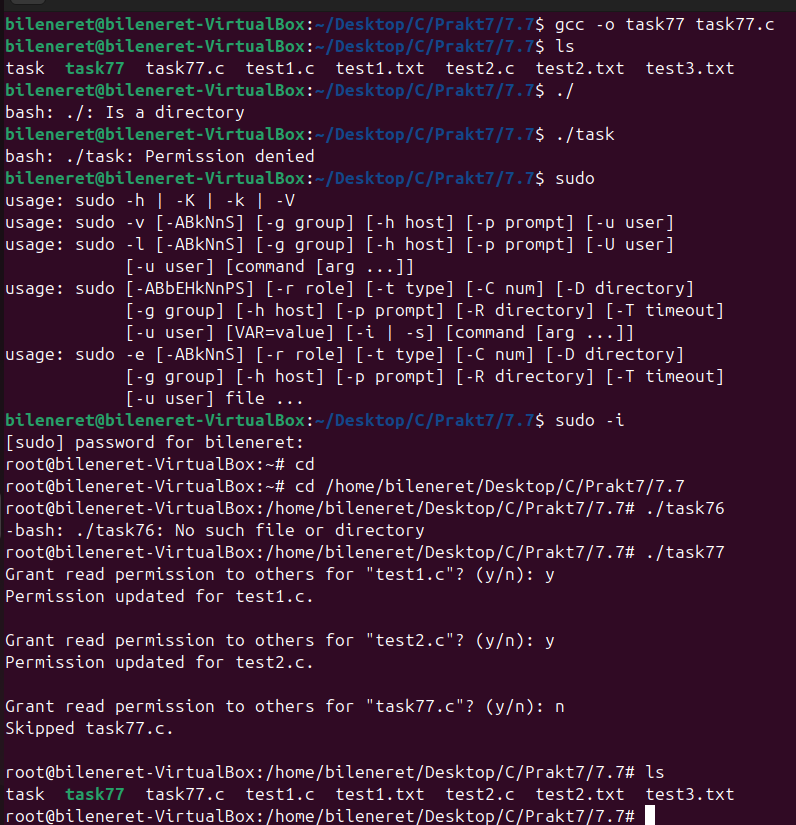

---

# ЗАВДАНЯ 8:

## Умова:
Напишіть програму, яка надає користувачу можливість видалити будь-який або всі файли у поточному робочому каталозі. Має з’являтися ім’я файлу з запитом, чи слід його видалити.

### Пояснення та опис програми:
Програма відкриває поточний каталог через `opendir()` і перебирає файли за допомогою `readdir()`, перевіряючи через `stat()`, чи є вони звичайними файлами. Для кожного файлу (наприклад, `dell1.txt`, `dell2.txt`, `text.txt`) виводиться запит "Delete file ...? (y/n)". Якщо введено `y` або `Y`, `unlink()` видаляє файл, як видно на скріншоті, де `dell1.txt` і `text.txt` видалено, а `task78.c` пропущено за вибором користувача.

### Результати:

## [Код завдання](7.8/task78.c)

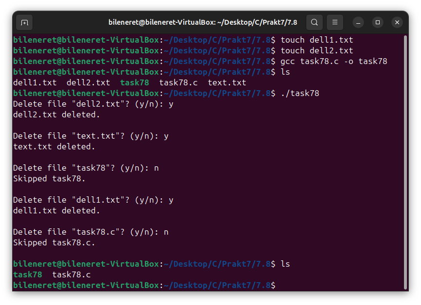

---

# ЗАВДАНЯ 9:

## Умова:
Напишіть програму на C, яка вимірює час виконання фрагмента коду в мілісекундах.

### Пояснення та опис програми:
Програма використовує `clock_gettime(CLOCK_MONOTONIC)` для запису часу до (`start`) і після (`end`) виконання вкладеного циклу (10 000 × 10 000 ітерацій). Різниця обчислюється в мілісекундах, враховуючи секунди (`tv_sec`) і наносекунди (`tv_nsec`) через ділення на 1 000 000. На скріншоті видно, що час виконання становить приблизно 204–230 мс, що залежить від системних умов, демонструючи точність вимірювання.

### Результати:

## [Код завдання](7.9/task79.c)

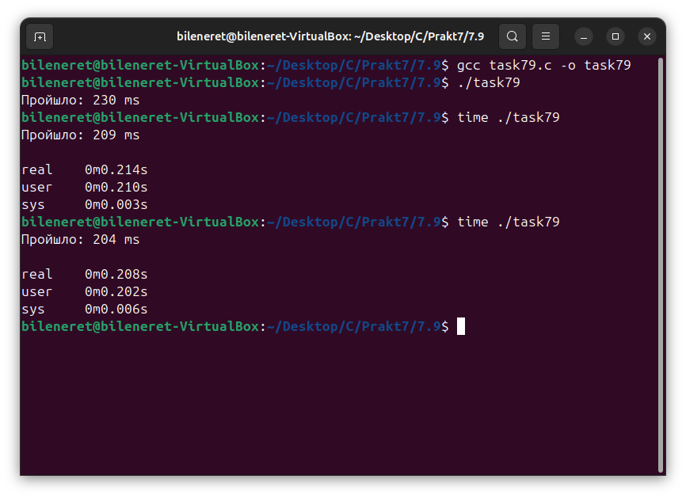

---

# ЗАВДАНЯ 10:

## Умова:
Напишіть програму мовою C для створення послідовності випадкових чисел з плаваючою комою у діапазонах: (a) від 0.0 до 1.0, (b) від 0.0 до n, де n — будь-яке дійсне число з плаваючою точкою. Початкове значення генератора випадкових чисел має бути встановлене так, щоб гарантувати унікальну послідовність. Примітка: використання прапорця `-Wall` під час компіляції є обов’язковим.

### Пояснення та опис програми:
Програма ініціалізує генератор випадкових чисел через `srand(time(NULL))` для унікальності послідовності. Значення `n` зчитується з аргументів (за замовчуванням 1.0), і для кожного діапазону ([0,1) та [0,n]) генерується 10 випадкових чисел, ділячи `rand()` на `RAND_MAX+1.0` і, для другого діапазону, множачи на `n`. На скріншоті видно два набори чисел: перші 10 у [0,1), другі 10 у [0,1.00], з різними значеннями, що підтверджує коректність генерації.

### Результати:

## [Код завдання](7.10/task710.c)

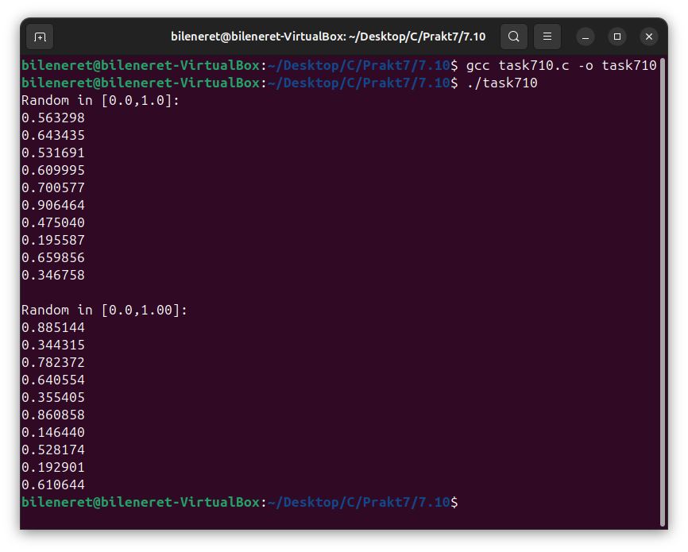

---

# ЗАВДАНЯ 11 (Варіант 14):

## Умова:
Реалізуйте засіб, який дозволяє відновити вилучений файл, якщо доступ до диску не було втрачено повністю.

### Пояснення та опис програми:
Програма відкриває вхідний файл (наприклад, `disk.bin`) у бінарному режимі для читання через `fopen("rb")` і сканує його побайтно, порівнюючи послідовності байтів із заданими сигнатурами (наприклад, `0xFF 0xD8` для початку JPEG). При виявленні початкової сигнатури створюється вихідний файл (наприклад, `out`), і дані записуються через `fputc()` до виявлення кінцевої сигнатури (наприклад, `0xFF 0xD9`). На скріншоті видно, що з `disk.bin` (містить "Hello World!") і `test.bin` (містить "New Hello World!") програма успішно відновила дані, визначивши сигнатуру `.jpg` і створивши `out.jpg`, хоча вихідний вміст не збігається з вхідними текстами через відсутність JPEG-даних.

### Результати:

## [Код завдання](V14/task711.c)

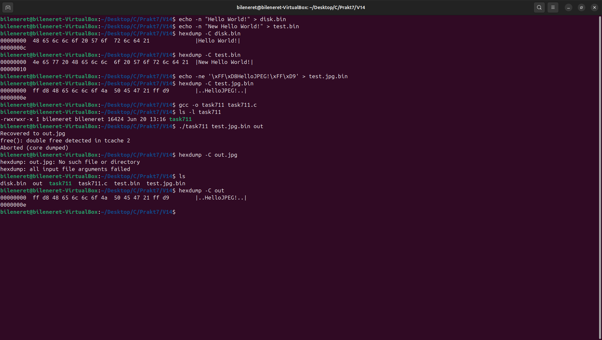

---
