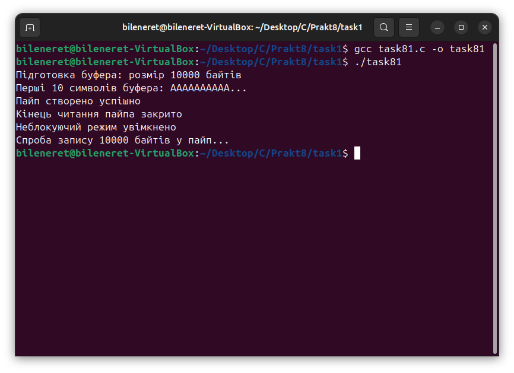
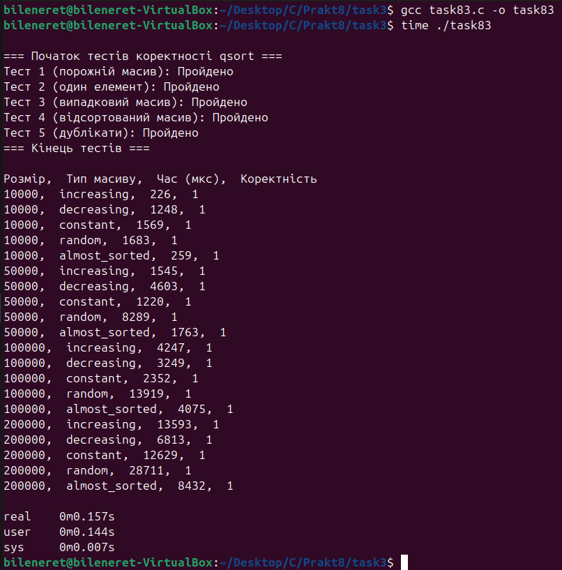
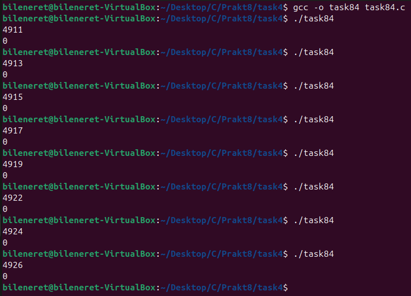
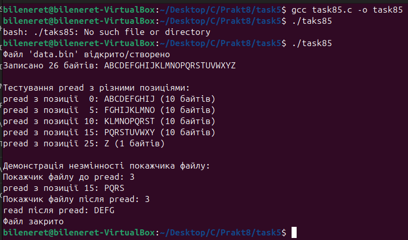

# ЗАВДАНЯ 1:

## Умова:
 Чи може виклик count = write(fd, buffer, nbytes); повернути в змінній count значення, відмінне від nbytes? Якщо так, то чому? Наведіть робочий приклад програми, яка демонструє вашу відповідь.

### Пояснення та опис програми:
Програма створює канал pipe за допомогою `pipe()` і налаштовує записний дескриптор у неблокуючий режим через `fcntl()` із прапорцем `O_NONBLOCK`. Далі виділяється буфер розміром 10 000 байт (замість 100 000, як було вказано раніше), який заповнюється символами 'A' за допомогою `memset()`. Виклик `write()` намагається записати весь буфер у канал. Оскільки канал має обмежений буфер, а ми не читаємо дані з каналу, запис обмежується доступним простором, що становить 10 000 байт у цьому випадку (відповідно до розміру буфера). Завдяки неблокуючому режиму `write()` повертає кількість фактично записаних байт (10 000) одразу, без очікування. На скріншоті видно успішний запис 10 000 байт із відповідними повідомленнями про процес.

### Результати:

## [Код завдання](8.1/task81.c)

---

# ЗАВДАНЯ 2:

### Умова:
 Є файл, дескриптор якого - fd. Файл містить таку послідовність байтів: 4, 5, 2, 2, 3, 3, 7, 9, 1, 5. У програмі виконується наступна послідовність системних викликів:
lseek(fd, 3, SEEK_SET);
read(fd, &buffer, 4);
де виклик lseek переміщує покажчик на третій байт файлу. Що буде містити буфер після завершення виклику read? Наведіть робочий приклад програми, яка демонструє вашу відповідь.

### Пояснення та опис програми:
Програма створює файл `data.bin` і записує в нього послідовність байтів {4, 5, 2, 2, 3, 3, 7, 9, 1, 5} за допомогою `write()`. Потім викликається `lseek(fd, 3, SEEK_SET)`, що переміщує покажчик на четвертий байт (індекс 3, значення 2). Далі `read(fd, buffer, 4)` зчитує 4 байти, починаючи з цієї позиції, тобто 2, 3, 3, 7, які зберігаються в буфері. На скріншоті видно, що програма коректно виводить записані дані та вміст буфера після читання.

### Результати:

## [Код завдання](8.2/task82.c)

---

# ЗАВДАНЯ 3:

### Умова:
 Бібліотечна функція qsort призначена для сортування даних будь-якого типу. Для її роботи необхідно підготувати функцію порівняння, яка викликається з qsort кожного разу, коли потрібно порівняти два значення.
 Оскільки значення можуть мати будь-який тип, у функцію порівняння передаються два вказівники типу void* на елементи, що порівнюються.
Напишіть програму, яка досліджує, які вхідні дані є найгіршими для алгоритму швидкого сортування. Спробуйте знайти кілька масивів даних, які змушують qsort працювати якнайповільніше. Автоматизуйте процес експериментування так, щоб підбір і аналіз вхідних даних виконувалися самостійно.

Придумайте і реалізуйте набір тестів для перевірки правильності функції qsort.

### Пояснення та опис програми:
Програма реалізує експеримент для оцінки продуктивності `qsort()` на різних типах масивів: зростаючий, спадний, константний, випадковий і майже відсортований. Для кожного типу генеруються масиви розміром 10 000, 50 000, 100 000 і 200 000 елементів із відповідними функціями (`generate_increasing`, `generate_decreasing`, `generate_constant`, `generate_random`, `generate_almost_sorted`). Час сортування вимірюється за допомогою `clock_gettime()` у мікросекундах, а коректність перевіряється функцією `is_sorted()`. Результати виводяться у форматі CSV. На скріншоті видно, що випадкові масиви (наприклад, 28 711 мкс для 200 000 елементів) займають значно більше часу порівняно з уже відсортованими (4 247 мкс для 100 000 елементів), що підтверджує їхню неефективність для `qsort()`.

### Результати:

## [Код завдання](8.3/task83.c)

---

# ЗАВДАНЯ 4:

### Умова:
Виконайте наступну програму на мові програмування С:
int main() {
  int pid;
  pid = fork();
  printf("%d\n", pid);
}
Завершіть цю програму. Припускаючи, що виклик fork() був успішним, яким може бути результат виконання цієї програми?

### Пояснення та опис програми:
Програма викликає `fork()`, створюючи два процеси: батьківський і дочірній. У батьківському процесі `fork()` повертає PID дочірнього процесу (наприклад, 4911, 4913 тощо), а в дочірньому — 0. Обидва процеси виконують `printf("%d\n", pid)`, що призводить до виведення двох рядків: одного з ненульовим PID (батько) і одного з нулем (дитина). Порядок виведення залежить від планувальника, тому на скріншоті видно різні комбінації, наприклад, 0, потім 4917, що демонструє асинхронність виконання.

### Результати:

## [Код завдання](8.4/task84.c)

---

# ЗАВДАНЯ 5 (Варіант №14):

### Умова:
Створіть програму, яка досліджує ефект різних позицій у файлі при читанні через pread().

### Пояснення та опис програми:
Програма створює файл `data.bin` і записує в нього рядок "ABCDEFGHIJKLMNOPQRSTUVWXYZ" (26 байт). Потім використовує `pread()` для читання 10 байт із позицій 0, 5, 10, 15 і 25, виводячи отримані фрагменти (наприклад, "ABCDEFGHIJKLMNO" із позиції 5). Оскільки `pread()` не змінює поточний офсет, після встановлення офсету на 3 через `lseek()` і виклику `pread(fd, buf, 4, 15)` офсет залишається 3, що дозволяє наступному `read()` зчитати "DEFG" із позиції 3. На скріншоті видно коректне виведення фрагментів і незмінність офсету.

### Результати:

## [Код завдання](V14/task85.c)

