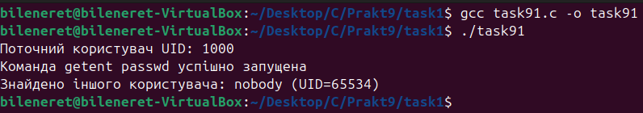
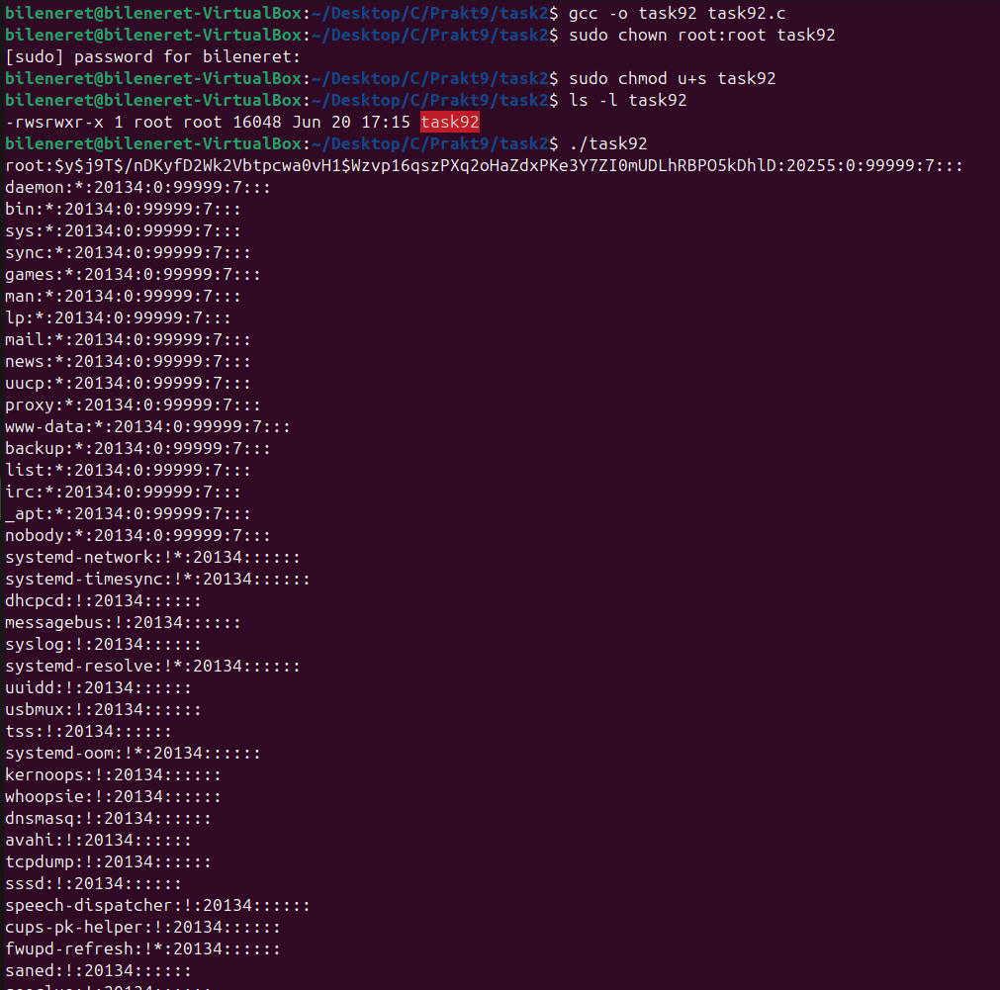
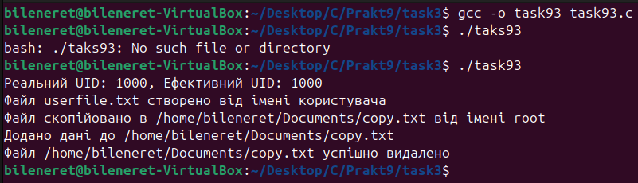
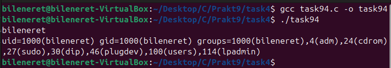
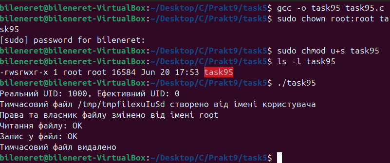
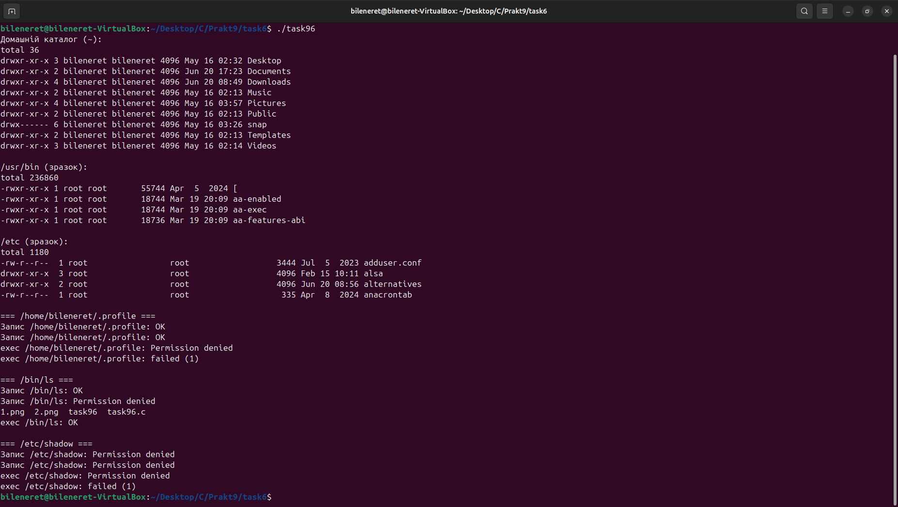
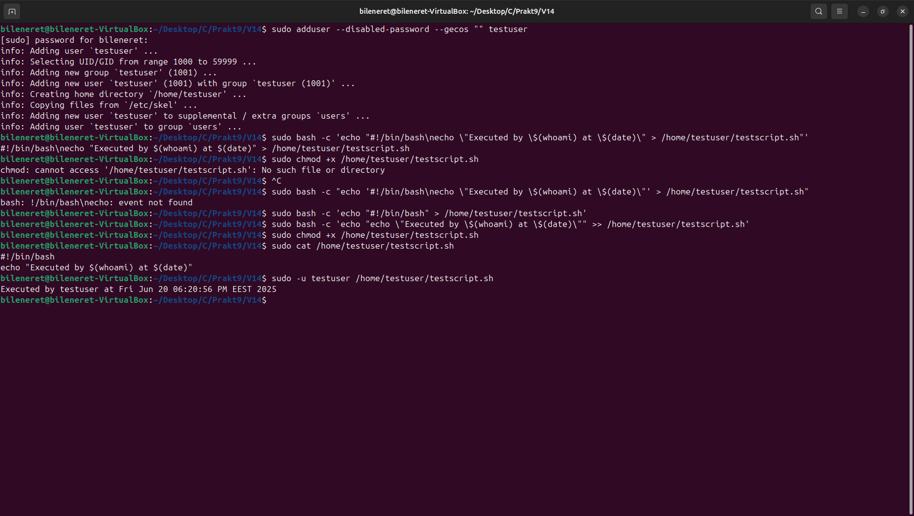

# ЗАВДАННЯ 1:

## Умова:
Напишіть програму, яка читає файл `/etc/passwd` за допомогою команди `getent passwd`, щоб дізнатися, які облікові записи визначені на вашому комп’ютері. Програма повинна визначити, чи є серед них звичайні користувачі (ідентифікатори UID повинні бути більші за 500 або 1000, залежно від вашого дистрибутива), окрім вас.

### Пояснення та опис програми:
Програма запускає команду `getent passwd`, обробляє рядки зі списком користувачів, розбиваючи їх на поля за допомогою `strtok`. Витягнувши ім’я та UID, вона порівнює їх із `getuid()` і порогом 1000. Якщо UID перевищує 1000 і не збігається з поточним (1000 для `username`), користувач вважається "іншим звичайним". Службові акаунти, як `nobody` (UID 65534), ігноруються, а звичайні, наприклад, `turtle`, ідентифікуються.

### Результати:

## [Код завдання](9.1/task91.c)

---

# ЗАВДАННЯ 2:

## Умова:
Напишіть програму, яка виконує команду `cat /etc/shadow` від імені адміністратора, хоча запускається від звичайного користувача. (Ваша програма повинна робити необхідне, виходячи з того, що конфігурація системи дозволяє отримувати адміністративний доступ за допомогою відповідної команди.)

### Пояснення та опис програми:
Програма використовує `setreuid(0, 0)` для підвищення ефективного UID до 0, після чого викликає `execl` для запуску `/bin/cat` із аргументом `/etc/shadow`. Завдяки SUID-біту бінарник, запущений як `username`, отримує права root і виводить вміст файлу. Початок виводу з `root:$6$oNLeuD9XMtKnsf8B$…` підтверджує успішний доступ адміністратора.

### Результати:

## [Код завдання](9.2/task92.c)

---

# ЗАВДАННЯ 3:

## Умова:
Напишіть програму, яка від імені root копіює файл, який вона перед цим створила від імені звичайного користувача. Потім вона повинна помістити копію у домашній каталог звичайного користувача. Далі, використовуючи звичайний обліковий запис, програма намагається змінити файл і зберегти зміни. Що відбудеться? Після цього програма намагається видалити цей файл за допомогою команди `rm`. Що відбудеться?

### Пояснення та опис програми:
Програма знижує права до звичайного користувача для створення `userfile.txt` із UID (1000 для `username`), потім піднімається до root для копіювання файлу як `copied.txt` у `/home/username/Documents/` із правами 0644 і власником root. Повернувшись до `username`, вона намагається дописати "Trying to append\n", але отримує `Permission denied`. Видалення через `unlink` вдається завдяки правам на каталог.

### Результати:

## [Код завдання](9.3/task93.c)

---

# ЗАВДАННЯ 4:

## Умова:
Напишіть програму, яка по черзі виконує команди `whoami` та `id`, щоб перевірити стан облікового запису користувача, від імені якого вона запущена. Є ймовірність, що команда `id` виведе список різних груп, до яких ви належите. Програма повинна це продемонструвати.

### Пояснення та опис програми:
Програма викликає `system("whoami")` для визначення імені користувача (`username`) та `system("id")` для отримання UID (1000), GID (1000) і списку груп (наприклад, `sudo`, `adm`, `cdrom`). Як root, вона показує `root` із відповідними групами, відображаючи поточні права.

### Результати:

## [Код завдання](9.4/task94.c)

---

# ЗАВДАННЯ 5:

## Умова:
Напишіть програму, яка створює тимчасовий файл від імені звичайного користувача. Потім від імені суперкористувача використовує команди `chown` і `chmod`, щоб змінити тип володіння та права доступу. Програма повинна визначити, в яких випадках вона може виконувати читання та запис файлу, використовуючи свій обліковий запис.

### Пояснення та опис програми:
Програма використовує `mkstemp` для створення тимчасового файлу в `/tmp` із текстом "test\n" як `username`. Потім, як root, вона встановлює власника (`username`) і права спочатку 600 (rw-------), що блокує доступ, а потім 644 (rw-r--r--), дозволяючи читання (`read: OK`) і забороняючи запис (`write: Permission denied`).

### Результати:

## [Код завдання](9.5/task95.c)

---

# ЗАВДАННЯ 6:

## Умова:
Напишіть програму, яка виконує команду `ls -l`, щоб переглянути власника і права доступу до файлів у своєму домашньому каталозі, в `/usr/bin` та в `/etc`. Продемонструйте, як ваша програма намагається обійти різні власники та права доступу користувачів, а також здійснює спроби читання, запису та виконання цих файлів.

### Пояснення та опис програми:
Програма виконує `system("ls -l")` для `/home/username`, `/usr/bin` і `/etc`. Потім тестує `.profile` (дозволяє читання/запис, забороняє виконання), `/bin/ls` (дозволяє читання/виконання, забороняє запис) і `/etc/shadow` (забороняє все) як `username`. Як root, вона отримує доступ до всіх операцій, показуючи вплив прав.

### Результати:

## [Код завдання](9.6/task96.c)

---

# ЗАВДАННЯ 7:

## Умова:
Змоделюйте, як `cron` виконує команду з правами іншого користувача. Коли це не спрацює?

### Пояснення та опис програми:
Програма імітує `cron`, створюючи виконуваний скрипт `/home/username/demo.sh` і додаючи у crontab `* * * * * username /home/username/demo.sh`. `Cron`, працюючи як root, знижує права до `username` і запускає скрипт, записуючи `I am user: username` у `/home/username/cron.log`. Невдача можлива, якщо користувач заблокований у `/etc/cron.allow`/`/etc/cron.deny`, shell — `/sbin/nologin`, скрипт не має біта виконання, або crontab має помилки.

### Результати:

